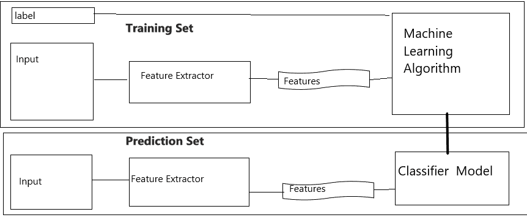
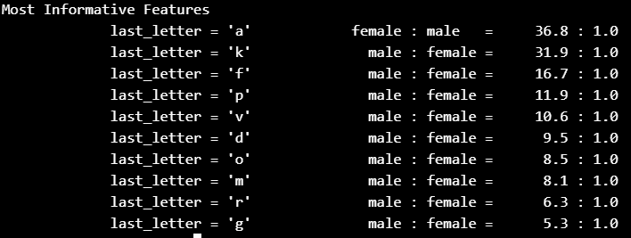

# Python |使用 NLTK 进行姓名性别识别

> 原文:[https://www . geesforgeks . org/python-性别-按姓名识别-使用-nltk/](https://www.geeksforgeeks.org/python-gender-identification-by-name-using-nltk/)

**自然语言工具包(NLTK)** 是一个用于构建文本分析程序的平台。我们可以观察到男性和女性的名字有一些鲜明的特点。以 a、e 和 I 结尾的名字很可能是女性，而以 k、o、r、s 和 t 结尾的名字很可能是男性。让我们构建一个分类器来更精确地模拟这些差异。

为了运行下面的 python 程序，您必须安装 NLTK。请遵循安装步骤。

```
pip install nltk
```

创建分类器的第一步是决定输入的哪些特征是相关的，以及如何编码这些特征。对于这个例子，我们将从查看给定名称的最后一个字母开始。下面的特征提取函数构建了一个包含给定名称相关信息的字典。

**示例:**

```
Input : gender_features('saurabh')
Output : {'last_letter': 'h'}
```

```
def gender_features(word):
     return {'last_letter': word[-1]}
gender_features('mahavir')
# output : {'last_letter': 'r'}
```

将弹出一个图形用户界面，然后选择下载所有软件包的“全部”，然后单击“下载”。这将为您提供所有的标记器、分块器、其他算法和所有的语料库，所以这就是为什么安装将花费相当长的时间。

```
nltk.download()
```

**分类**是为给定输入选择正确类别标签的任务。在基本分类任务中，每个输入都被认为与所有其他输入隔离，并且标签集是预先定义的。分类任务的一些例子有:

1.  决定一封邮件是否是垃圾邮件。
2.  从“体育”、“科技”和“政治”等固定的主题领域列表中决定新闻文章的主题
3.  决定一个给定的词“银行”是用来指河岸、金融机构、向一侧倾斜的行为，还是指在金融机构中存放某物的行为。

基本分类任务有许多有趣的变体。例如，在多类分类中，每个实例可以被分配多个标签；在开放类分类中，标签集没有预先定义；在序列分类中，输入列表被联合分类。

如果一个**分类器是基于包含每个输入的正确标签的训练语料库构建的，则称之为监督的。监督分类使用的**框架**如图所示。

训练集用于训练模型，开发测试集用于进行误差分析。该测试集用于我们对系统的最终评估。由于下面讨论的原因，我们使用一个单独的开发测试集来进行错误分析是很重要的，而不仅仅是使用测试集。**

语料库数据划分为不同子集如下图所示:


从这里获取所用文本文件的链接–

*   直接通过文本 URL。[男. txt](https://media.geeksforgeeks.org/wp-content/uploads/male.txt)[女. txt](https://media.geeksforgeeks.org/wp-content/uploads/female.txt)
*   `male.txt`和`female.txt`文件自动下载，同时`nltk.download()`方法成功执行。本地系统中的路径:
    nltk 的路径:`C:\Users\currentUserName\AppData\Roaming`
    nltk 内部文件的路径:`\nltk_data\corpora\names`

```
# importing libraries
import random
from nltk.corpus import names
import nltk

def gender_features(word):
    return {'last_letter':word[-1]}

# preparing a list of examples and corresponding class labels.
labeled_names = ([(name, 'male') for name in names.words('male.txt')]+
             [(name, 'female') for name in names.words('female.txt')])

random.shuffle(labeled_names)

# we use the feature extractor to process the names data.
featuresets = [(gender_features(n), gender) 
               for (n, gender)in labeled_names]

# Divide the resulting list of feature
# sets into a training set and a test set.
train_set, test_set = featuresets[500:], featuresets[:500]

# The training set is used to 
# train a new "naive Bayes" classifier.
classifier = nltk.NaiveBayesClassifier.train(train_set)

print(classifier.classify(gender_features('mahavir')))

# output should be 'male'
print(nltk.classify.accuracy(classifier, train_set))

# it shows accurancy of our classifier and 
# train_set. which must be more than 99 % 
# classifier.show_most_informative_features(10)
```

**从分类器获取信息特征:**

```
classifier.show_most_informative_features(10)
# 10 indicates 10 rows
```

**输出:**
