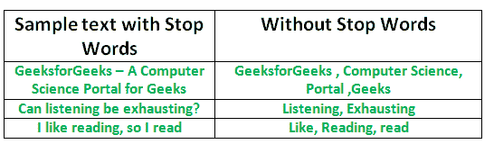

# 用 Python 中的 NLTK 去除停止词

> 原文:[https://www . geesforgeks . org/remove-stop-words-nltk-python/](https://www.geeksforgeeks.org/removing-stop-words-nltk-python/)

将数据转换成计算机可以理解的东西的过程称为**预处理。**预处理的主要形式之一是过滤掉无用的数据。在自然语言处理中，无用的词(数据)被称为停止词。

**什么是停止词？**

**Stop Words:**Stop Words 是一个常用词(如“the”、“A”、“an”、“in”)，搜索引擎已被编程为忽略该词，无论是在为搜索索引条目时还是在作为搜索查询的结果检索条目时。
我们不希望这些词占用我们数据库的空间，或者占用宝贵的处理时间。为此，我们可以很容易地删除它们，方法是存储一个单词列表，您认为它可以阻止单词。python 中的 NLTK(自然语言工具包)有一个存储在 16 种不同语言中的停用词列表。您可以在 nltk_data 目录中找到它们。*home/pratima/nltk _ data/corpora/stop words*是目录地址。(不要忘记更改您的主目录名)



**要检查停止词列表，可以在 python shell 中键入以下命令。**

```py
import nltk
from nltk.corpus import stopwords
print(stopwords.words('english'))
```

{ '我们自己'，'她的'，'之间'，'你自己'，'但是'，'再'，'那里'，'关于'，'曾经'，'期间'，'出'，'非常'，'有'，'有'，'有'，'一些'，'为'，'做'，'它的'，'你的'，'你的'，'这样'，'进入'，'的'，'最'，'本身'，'其他'，'关'，'是'，' s '，'是'，'的'，'我们的'，'这些'，'你的'，'他的'，'通过'，'不'，'我的'，'是'，'她'，'更多'， will '，' on '，' does '，' yourselves '，' then '，' what '，' over '，' why '，' so '，' can '，' did '，' not '，' now '，' now '，' now '，' now '，' being '，' under '，' he '，' you '，' sheet '，' has '，' just '，' what '，' what '，' what '，' than'}
**注意:**你甚至可以在 stop 中的英文 txt. file 中添加自己选择的单词来修改列表。

**用 NLTK 去除停止字**

以下程序从一段文本中删除停止词:

## 蟒蛇 3

```py
from nltk.corpus import stopwords
from nltk.tokenize import word_tokenize

example_sent = """This is a sample sentence,
                  showing off the stop words filtration."""

stop_words = set(stopwords.words('english'))

word_tokens = word_tokenize(example_sent)

filtered_sentence = [w for w in word_tokens if not w.lower() in stop_words]

filtered_sentence = []

for w in word_tokens:
    if w not in stop_words:
        filtered_sentence.append(w)

print(word_tokens)
print(filtered_sentence)
```

输出:

```py
['This', 'is', 'a', 'sample', 'sentence', ',', 'showing', 
'off', 'the', 'stop', 'words', 'filtration', '.']
['This', 'sample', 'sentence', ',', 'showing', 'stop',
'words', 'filtration', '.']
```

**在文件中执行停止字操作**

在下面的代码中，text.txt 是要删除 stopwords 的原始输入文件。filteredtext.txt 是输出文件。可以使用以下代码完成:

## 蟒蛇 3

```py
import io
from nltk.corpus import stopwords
from nltk.tokenize import word_tokenize

# word_tokenize accepts
# a string as an input, not a file.
stop_words = set(stopwords.words('english'))
file1 = open("text.txt")

# Use this to read file content as a stream:
line = file1.read()
words = line.split()
for r in words:
    if not r in stop_words:
        appendFile = open('filteredtext.txt','a')
        appendFile.write(" "+r)
        appendFile.close()
```

这就是我们如何通过删除对未来操作没有任何贡献的单词来提高处理内容的效率。
本文由 **Pratima Upadhyay** 供稿。如果你喜欢 GeeksforGeeks 并想投稿，你也可以使用[write.geeksforgeeks.org](https://write.geeksforgeeks.org)写一篇文章或者把你的文章邮寄到 contribute@geeksforgeeks.org。看到你的文章出现在极客博客主页上，帮助其他极客。
如果发现有不正确的地方，或者想分享更多关于上述话题的信息，请写评论。