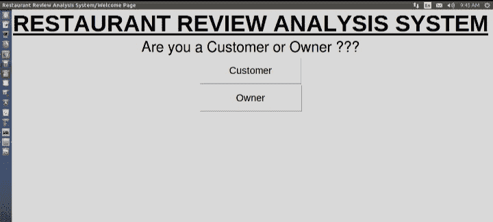
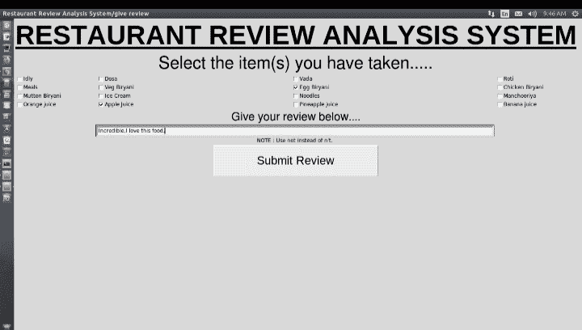
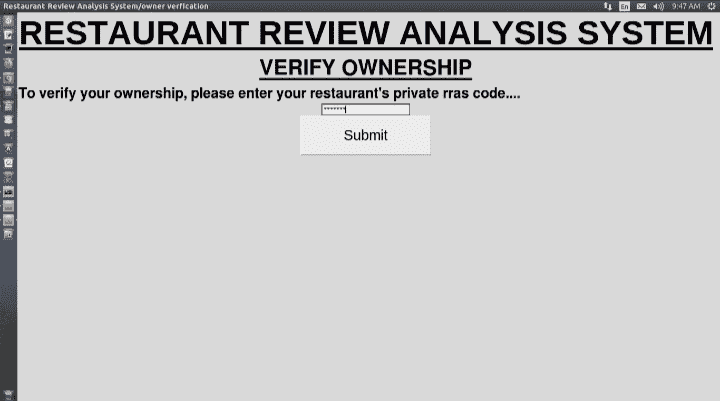
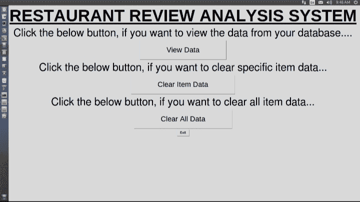
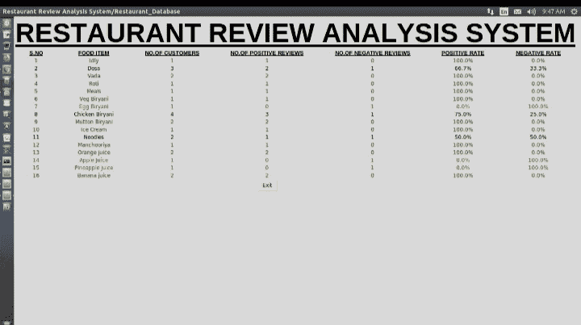
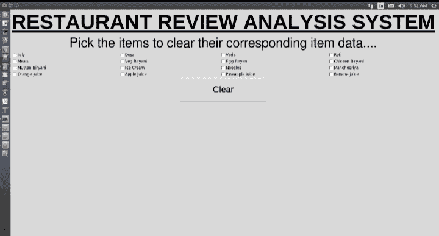

# 使用 NLP 和 SQLite 的餐厅点评分析

> 原文:[https://www . geesforgeks . org/restaurant-review-analysis-use-NLP-and-SQLite/](https://www.geeksforgeeks.org/restaurant-review-analysis-using-nlp-and-sqlite/)

通常情况下，很多企业由于缺乏利润、缺乏适当的改进措施而被视为失败。大多数情况下，餐馆老板面临很多困难来提高他们的生产力。这个项目确实帮助了那些想提高生产力的人，这反过来又增加了他们的商业利润。这是这个项目的主要目标。

该项目所做的是，餐馆老板通过顾客的文本评论了解他的餐馆的缺点，例如他的餐馆最不喜欢的食物，该文本评论用最大似然分类算法(朴素贝叶斯)处理，其结果用 SQLite 存储在数据库中。

## 使用的工具和技术:

*   我是 NLTK
*   机器学习
*   计算机编程语言
*   Tkinter
*   Sqlite3
*   熊猫

## 逐步实施:

### 步骤 1:导入库和初始化数据

首先，我们导入 [NumPy](https://www.geeksforgeeks.org/numpy-in-python-set-1-introduction/) 、 [matplotlib](https://www.geeksforgeeks.org/matplotlib-tutorial/) 、 [pandas](https://www.geeksforgeeks.org/python-pandas-dataframe/) 、nltk、re、sklearn、 [Tkinter](https://www.geeksforgeeks.org/python-gui-tkinter/) 、sqlite3 库，这些库用于数据操作、文本数据处理、模式识别、数据训练、图形用户界面和数据库上的数据操作。

## 蟒蛇 3

```py
import numpy as np
import matplotlib.pyplot as plt
import pandas as pd
import re
import nltk
from nltk.corpus import stopwords
from nltk.stem.porter import PorterStemmer
from sklearn.feature_extraction.text import CountVectorizer
from sklearn.model_selection import train_test_split
from sklearn.naive_bayes import GaussianNB
from sklearn.metrics import accuracy_score
from tkinter import *
import sqlite3

dataset = pd.read_csv('Restaurant_Reviews.tsv',
                      delimiter='\t', quoting=3)
corpus = []
rras_code = "Wyd^H3R"
food_rev = {}
food_perc = {}

conn = sqlite3.connect('Restaurant_food_data.db')
c = conn.cursor()

for i in range(0, 1000):
    review = re.sub('[^a-zA-Z]', ' ', dataset['Review'][i])
    review = review.lower()
    review = review.split()

    ps = PorterStemmer()
    all_stopwords = stopwords.words('english')
    all_stopwords.remove('not')

    review = [ps.stem(word)
              for word in review if not word in set(all_stopwords)]

    review = ' '.join(review)
    corpus.append(review)

cv = CountVectorizer(max_features=1500)
X = cv.fit_transform(corpus).toarray()
y = dataset.iloc[:, -1].values

X_train, X_test, y_train, y_test = train_test_split(
    X, y, test_size=0.20, random_state=0)

classifier = GaussianNB()
classifier.fit(X_train, y_train)

y_pred = classifier.predict(X_test)

variables = []
clr_variables = []

foods = ["Idly", "Dosa", "Vada", "Roti", "Meals", "Veg Biryani",
         "Egg Biryani", "Chicken Biryani", "Mutton Biryani",
         "Ice Cream", "Noodles", "Manchooriya", "Orange juice",
         "Apple Juice", "Pineapple juice", "Banana juice"]

for i in foods:
    food_rev[i] = []
    food_perc[i] = [0.0, 0.0]

def init_data():

    conn = sqlite3.connect('Restaurant_food_data.db')
    c = conn.cursor()
    for i in range(len(foods)):
        c.execute("INSERT INTO item VALUES(:item_name,:no_of_customers,\
        :no_of_positives,:no_of_negatives,:pos_perc,:neg_perc)",
                  {
                      'item_name': foods[i],
                      'no_of_customers': "0",
                      'no_of_positives': "0",
                      'no_of_negatives': "0",
                      'pos_perc': "0.0%",
                      'neg_perc': "0.0%"
                  }
                  )
    conn.commit()
    conn.close()
```

### 第二步:向用户说明

最初，我们的图形用户界面应用程序询问用户他是所有者还是客户，以决定要执行什么操作。

## 蟒蛇 3

```py
root1 = Tk()
main = "Restaurant Review Analysis System/"
root1.title(main+"Welcome Page")

label = Label(root1, text="RESTAURANT REVIEW ANALYSIS SYSTEM",
              bd=2, font=('Arial', 47, 'bold', 'underline'))

ques = Label(root1, text="Are you a Customer or Owner ???")

cust = Button(root1, text="Customer", font=('Arial', 20),
              padx=80, pady=20, command=take_review)

owner = Button(root1, text="Owner", font=('Arial', 20),
               padx=100, pady=20, command=login)

'''conn=sqlite3.connect('Restaurant_food_data.db')
c=conn.cursor()
c.execute("CREATE TABLE item (Item_name text,No_of_customers text,\
No_of_positive_reviews text,No_of_negative_reviews text,Positive_percentage \
text,Negative_percentage text) ")
conn.commit()
conn.close()'''
#c.execute("DELETE FROM item")

root1.attributes("-zoomed", True)
label.grid(row=0, column=0)
ques.grid(row=1, column=0, sticky=W+E)
ques.config(font=("Helvetica", 30))
cust.grid(row=2, column=0)
owner.grid(row=3, column=0)
conn.commit()
conn.close()
root1.mainloop()
```



澄清用户

### 第三步:收集数据

一旦系统确定用户是顾客，它就会要求以文本格式进行食品审查。顾客必须选择他从餐馆拿走的食物，然后对选择的食物进行评论。当他点击提交按钮时，文本评论将在最大似然算法下处理，以预测它是正面评论还是负面评论。然后，整个数据被插入数据库。

## 蟒蛇 3

```py
def take_review():
    root2 = Toplevel()
    root2.title(main+"give review")

    label = Label(root2, text="RESTAURANT REVIEW ANALYSIS SYSTEM",
                  bd=2, font=('Arial', 47, 'bold', 'underline'))

    req1 = Label(root2, text="Select the item(s) you have taken.....")

    conn = sqlite3.connect('Restaurant_food_data.db')
    c = conn.cursor()

    chk_btns = []
    selected_foods = []
    req2 = Label(root2, text="Give your review below....")
    rev_tf = Entry(root2, width=125, borderwidth=5)
    req3 = Label(root2, text="NOTE : Use not instead of n't.")
    global variables
    variables = []
    chk_btns = []

    for i in range(len(foods)):
        var = IntVar()
        chk = Checkbutton(root2, text=foods[i], variable=var)
        variables.append(var)
        chk_btns.append(chk)

    label.grid(row=0, column=0, columnspan=4)
    req1.grid(row=1, column=0, columnspan=4, sticky=W+E)
    req1.config(font=("Helvetica", 30))

    for i in range(4):
        for j in range(4):
            c = chk_btns[i*4+j]
            c.grid(row=i+3, column=j, columnspan=1, sticky=W)
    selected_foods = []

    submit_review = Button(root2, text="Submit Review", font=(
        'Arial', 20), padx=100, pady=20, command=lambda: [
        estimate(rev_tf.get()), root2.destroy()])

    root2.attributes("-zoomed", True)
    req2.grid(row=7, column=0, columnspan=4, sticky=W+E)
    req2.config(font=("Helvetica", 20))
    rev_tf.grid(row=8, column=1, rowspan=3, columnspan=2, sticky=S)
    req3.grid(row=11, column=1, columnspan=2)
    submit_review.grid(row=12, column=0, columnspan=4)
    conn.commit()
    conn.close()

# Processing and storing the data
def estimate(s):

    conn = sqlite3.connect('Restaurant_food_data.db')
    c = conn.cursor()
    review = re.sub('[^a-zA-Z]', ' ', s)
    review = review.lower()
    review = review.split()
    ps = PorterStemmer()
    all_stopwords = stopwords.words('english')
    all_stopwords.remove('not')

    review = [ps.stem(word)
              for word in review if not word in set(all_stopwords)]
    review = ' '.join(review)
    X = cv.transform([review]).toarray()
    res = classifier.predict(X)  # list

    if "not" in review:
        res[0] = abs(res[0]-1)

    selected_foods = []
    for i in range(len(foods)):
        if variables[i].get() == 1:
            selected_foods.append(foods[i])

    c.execute("SELECT *,oid FROM item")
    records = c.fetchall()

    for i in records:
        rec = list(i)
        if rec[0] in selected_foods:
            n_cust = int(rec[1])+1
            n_pos = int(rec[2])
            n_neg = int(rec[3])

            if res[0] == 1:
                n_pos += 1
            else:
                n_neg += 1

            pos_percent = round((n_pos/n_cust)*100, 1)
            neg_percent = round((n_neg/n_cust)*100, 1)
            c.execute("""UPDATE item SET Item_name=:item_name,No_of_customers\
            =:no_of_customers,No_of_positive_reviews=:no_of_positives,\
            No_of_negative_reviews=:no_of_negatives,Positive_percentage\
            =:pos_perc,Negative_percentage=:neg_perc  where oid=:Oid""",
                      {
                          'item_name': rec[0],
                          'no_of_customers': str(n_cust),
                          'no_of_positives': str(n_pos),
                          'no_of_negatives': str(n_neg),
                          'pos_perc': str(pos_percent)+"%",
                          'neg_perc': str(neg_percent)+"%",
                          'Oid': foods.index(rec[0])+1
                      }
                      )
    selected_foods = []

    conn.commit()
    conn.close()
```



复习

### 步骤 4:验证所有权

如果系统的当前用户是餐馆的所有者，则系统通过询问 rras_code(即唯一标识全世界餐馆的代码)来验证所有者。并且它是高度机密的，除了餐馆的共同所有者之外，人们不应该与其他人共享这个代码)。

## 蟒蛇 3

```py
def login():
    root3 = Toplevel()
    root3.title(main+"owner verification")

    label = Label(root3, text="RESTAURANT REVIEW ANALYSIS SYSTEM",
                  bd=2, font=('Arial', 47, 'bold', 'underline'))

    label2 = Label(root3, text="VERIFY OWNERSHIP", bd=1,
                   font=('Helvetica', 30, 'bold', 'underline'))

    label3 = Label(root3, text="To verify your ownership, please \
    enter your restaurant's private rras code....",
                   bd=1, font=('Helvetica', 20, 'bold'))
    ent = Entry(root3, show="*", borderwidth=2)
    submit_code = Button(root3, text="Submit", font=('Arial', 20), padx=80,
                         pady=20, command=lambda: [
                           view_details(ent.get()), root3.destroy()])

    root3.attributes("-zoomed", True)
    label.grid(row=0, column=0, columnspan=3)
    label2.grid(row=1, column=0, sticky=W+E, columnspan=3)
    label3.grid(row=2, column=0, sticky=W, columnspan=3)
    ent.grid(row=3, column=1, columnspan=1)
    submit_code.grid(row=4, column=1, columnspan=1)
```



验证所有权

### 步骤 5:访问数据

当所有权得到验证时，所有者在新页面上有 3 个选项，如下所述:

## 蟒蛇 3

```py
def popup():
    messagebox.showerror("Error Message!", "Incorrect code!")

def view_details(s):
    if(s != rras_code):
        popup()
    else:
        root4 = Toplevel()
        root4.title(main+"view_details")
        label = Label(root4, text="RESTAURANT REVIEW ANALYSIS SYSTEM",
                      bd=2, font=('Arial', 47, 'bold', 'underline'))
        sug1 = Label(
            root4, text="Click the below button, if you want to view\
            the data from your database....")

        acc_btn = Button(root4, text="View Data", font=(
            'Arial', 20), padx=100, pady=20, command=access_data)

        sug2 = Label(root4, text="Click the below button, if you want \
        to clear specific item data...")

        itemclr_btn = Button(root4, text="Clear Item Data", font=(
            'Arial', 20), padx=100, pady=20, command=clr_itemdata)

        sug3 = Label(root4, text="Click the below button, if you want to\
        clear all item data...")

        allclr_btn = Button(root4, text="Clear All Data", font=(
            'Arial', 20), padx=100, pady=20, command=clr_alldata)

        exit_btn = Button(root4, text="Exit", command=root4.destroy)

        root4.attributes("-zoomed", True)
        label.grid(row=0, column=0)
        sug1.grid(row=1, column=0)
        sug1.config(font=("Helvetica", 30))
        acc_btn.grid(row=2, column=0)
        sug2.grid(row=3, column=0)
        sug2.config(font=("Helvetica", 30))
        itemclr_btn.grid(row=4, column=0)
        sug3.grid(row=5, column=0)
        sug3.config(font=("Helvetica", 30))
        allclr_btn.grid(row=6, column=0)
        exit_btn.grid(row=9, column=0, sticky=S)
```



选择

### 步骤 6:查看数据

所有者可以查看数据库中的数据，其中每种食物都具有诸如顾客数量、正面评价数量、负面评价数量、正面率、负面率等属性。高阳性食品用绿色标注，最低阳性食品用红色标注，以便于理解数据摘要。现在，主人可以识别低等级的食物，并试图通过采取一些措施来改善食物的味道，比如叫新厨师等。，这无疑改善了他的业务。

## 蟒蛇 3

```py
def access_data():
    root5 = Toplevel()
    root5.title(main+"Restaurant_Database")

    label = Label(root5, text="RESTAURANT REVIEW ANALYSIS SYSTEM",
                  bd=2, font=('Arial', 47, 'bold', 'underline'))

    title1 = Label(root5, text="S.NO", font=('Arial', 10, 'bold', 'underline'))

    title2 = Label(root5, text="FOOD ITEM", font=(
        'Arial', 10, 'bold', 'underline'))

    title3 = Label(root5, text="NO.OF CUSTOMERS",
                   font=('Arial', 10, 'bold', 'underline'))

    title4 = Label(root5, text="NO.OF POSITIVE REVIEWS",
                   font=('Arial', 10, 'bold', 'underline'))

    title5 = Label(root5, text="NO.OF NEGATIVE REVIEWS",
                   font=('Arial', 10, 'bold', 'underline'))

    title6 = Label(root5, text="POSITIVE RATE",
                   font=('Arial', 10, 'bold', 'underline'))

    title7 = Label(root5, text="NEGATIVE RATE",
                   font=('Arial', 10, 'bold', 'underline'))

    label.grid(row=0, column=0, columnspan=7)
    title1.grid(row=1, column=0)
    title2.grid(row=1, column=1)
    title3.grid(row=1, column=2)
    title4.grid(row=1, column=3)
    title5.grid(row=1, column=4)
    title6.grid(row=1, column=5)
    title7.grid(row=1, column=6)

    conn = sqlite3.connect('Restaurant_food_data.db')
    c = conn.cursor()

    c.execute("SELECT *,oid from item")
    records = c.fetchall()
    pos_rates = []

    for record in records:
        record = list(record)
        pos_rates.append(float(record[-3][:-1]))

    max_pos = max(pos_rates)
    min_pos = min(pos_rates)

    for i in range(len(records)):
        rec_list = list(records[i])
        if str(max_pos)+"%" == rec_list[-3]:
            rec_lab = [Label(root5, text=str(rec_list[-1]), fg="green")]
            for item in rec_list[:-1]:
                lab = Label(root5, text=item, fg="green")
                rec_lab.append(lab)
        elif str(min_pos)+"%" == rec_list[-3]:
            rec_lab = [Label(root5, text=str(rec_list[-1]), fg="red")]
            for item in rec_list[:-1]:
                lab = Label(root5, text=item, fg="red")
                rec_lab.append(lab)
        else:
            rec_lab = [Label(root5, text=str(rec_list[-1]))]
            for item in rec_list[:-1]:
                lab = Label(root5, text=item)
                rec_lab.append(lab)

        for j in range(len(rec_lab)):
            rec_lab[j].grid(row=i+2, column=j)

    exit_btn = Button(root5, text="Exit", command=root5.destroy)
    exit_btn.grid(row=len(records)+5, column=3)

    conn.commit()
    conn.close()
    root5.attributes("-zoomed", True)
```



数据库内容

### 步骤 7:清除数据:

当进行了一些调整或修改时，所有者可以清除那些特定的项目数据，以便他可以快速观察食品的性能。如果主人愿意，他也可以清除所有食品项目数据。

## 蟒蛇 3

```py
def clr_itemdata():
    root6 = Toplevel()
    root6.title(main+"clear_item_data")

    label = Label(root6, text="RESTAURANT REVIEW ANALYSIS SYSTEM",
                  bd=2, font=('Arial', 47, 'bold', 'underline'))

    req1 = Label(root6, text="Pick the items to clear their corresponding\
    item data....")

    chk_list = []
    global clr_variables
    clr_variables = []

    for i in range(len(foods)):
        var = IntVar()
        chk = Checkbutton(root6, text=foods[i], variable=var)
        clr_variables.append(var)
        chk_list.append(chk)

    label.grid(row=0, column=0, columnspan=4)
    req1.grid(row=1, column=0, columnspan=4, sticky=W+E)
    req1.config(font=("Helvetica", 30))

    for i in range(4):
        for j in range(4):
            c = chk_list[i*4+j]
            c.grid(row=i+3, column=j, columnspan=1, sticky=W)

    clr_item = Button(root6, text="Clear", font=(
        'Arial', 20), padx=100, pady=20, command=lambda: [
      clr_data(), root6.destroy()])

    clr_item.grid(row=8, column=0, columnspan=4)
    root6.attributes("-zoomed", True)

def clr_alldata():
    confirm = messagebox.askquestion(
        "Confirmation", "Are you sure to delete all data??")

    if confirm == "yes":
        conn = sqlite3.connect('Restaurant_food_data.db')
        c = conn.cursor()
        for i in range(len(foods)):
            c.execute("""UPDATE item SET Item_name=:item_name,No_of_customers\
            =:no_of_customers,No_of_positive_reviews=:no_of_positives,\
            No_of_negative_reviews=:no_of_negatives,Positive_percentage=:\
            pos_perc,Negative_percentage=:neg_perc  where oid=:Oid""",
                      {
                          'item_name': foods[i],
                          'no_of_customers': "0",
                          'no_of_positives': "0",
                          'no_of_negatives': "0",
                          'pos_perc': "0.0%",
                          'neg_perc': "0.0%",
                          'Oid': i+1
                      }
                      )
        conn.commit()
        conn.close()
```



清除食品项目数据

最后，这是我用技术提高企业生产力的想法。这样，业务问题就会因生产率的提高而停止。

### 现实生活中的项目应用:

*   它可以在任何餐厅/酒店使用。
*   有效的食品改善措施，直接改善一个人的业务。
*   用户友好的。
*   没有业务损失的可能。