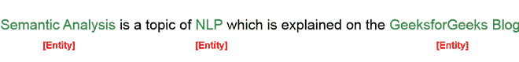

# 理解语义分析–NLP

> 原文:[https://www . geesforgeks . org/understanding-语义-分析-nlp/](https://www.geeksforgeeks.org/understanding-semantic-analysis-nlp/)

## 语义分析导论

语义分析是自然语言处理的一个分支，试图理解自然语言的含义。对我们人类来说，理解自然语言似乎是一个简单的过程。然而，由于人类语言的巨大复杂性和主观性，对机器来说，解释它是一项相当复杂的任务。自然语言的语义分析捕捉给定文本的含义，同时考虑上下文、句子的逻辑结构和语法角色。

## 语义分析部分

自然语言的语义分析可以分为两大部分:

**1。词汇语义分析:**词汇语义分析包括单独理解文本中每个单词的含义。它基本上是指获取字典，意思是文本中的一个单词被委托携带。

**2。组合语义分析:**虽然知道文本每个词的意思是必不可少的，但完全理解文本的意思是不够的。

例如，考虑以下两个句子:

*   **第一句:**学生爱极客 forGeeks。
*   **第二句:** GeeksforGeeks 爱学生。

虽然这两个句子 1 和 2 都使用了相同的词根{student，love，geeksforgeeks}，但它们传达了完全不同的意思。

因此，在组合语义分析下，我们试图理解单个单词的组合如何形成文本的意义。

## 语义分析中涉及的任务

为了理解句子的意思，以下是语义分析中涉及的主要过程:

1.  词义消歧
2.  关系抽取

### 词义消歧:

在自然语言中，一个词的意思可能会因其在句子中的用法和文本的上下文而异。词义消歧包括根据单词在文本中出现的上下文来解释单词的意思。

例如，“吠叫”这个词可能意味着“狗发出的声音”或者“树的最外层”

同样，“摇滚”一词可能意味着“石头”或“T2”一种音乐类型——因此，该词的准确含义在很大程度上取决于其上下文和在文本中的用法。

因此，机器能够克服基于用法和上下文来识别词义的歧义，这种能力被称为词义消歧。

### 关系提取:

语义分析涉及的另一个重要任务是关系抽取。它首先识别句子中存在的各种实体，然后提取这些实体之间的关系。

例如，考虑以下句子:

语义分析是自然语言处理的一个主题，在极客博客上有解释。本文涉及的实体及其关系如下所示。

实体

关系

## 语义分析的要素

在处理自然语言时，语义分析的一些关键要素必须仔细检查和考虑，这些要素是:

*   **上下义关系:**上下义关系是指作为通称实例的术语。可以把类对象作为类比来理解。例如:“*颜色*是上下义词，而“*灰色*”、“*蓝色*”、“*红色*等是其上下义词。
*   **同音异义:**同音异义是指两个或两个以上拼写相同但意义完全不同的词汇术语。例如:“*玫瑰*可能意味着“*过去的上升形式*或“*一朵花*”,拼写相同但意思不同；因此，*玫瑰*是一个同音异义词。
*   **同义关系:**当两个或两个以上可能被清楚拼写的词汇具有相同或相似的意思时，它们被称为同义关系。例如:*(工作，职业)，(大，大)，(停，停)。*
*   **反义词:**反义词是指一对具有相反意义的词汇术语——它们相对于一个语义轴是对称的。例如:*(白天，夜晚)，(热，冷)，(大，小)。*
*   **一词多义:**一词多义是指具有相同拼写但有多个密切相关意义的词汇术语。它不同于同形异义，因为在同形异义的情况下，术语的含义不需要密切相关。例如:“*人*”可能意味着“*人类物种*”或“*男性人类*”或“*成年男性人类*”——由于所有这些不同的含义有着密切的联系，词汇术语“*人*”是一个多义词。
*   **部分律:**部分律是指一个词汇术语是某个更大实体的组成部分的关系。例如:“*车轮*是“*汽车*的谐音”

## 意义表征

作为人类，理解文本信息的含义对我们来说非常简单，但对机器来说却不是这样。因此，机器倾向于以特定的格式表示文本，以便解释其含义。这种用来理解文本意义的形式结构被称为意义表征。

### 语义系统的基本单位:

为了完成语义分析中的意义表示，理解这种表示的构建单元是至关重要的。语义系统的基本单位解释如下:

1.  **实体:**实体是指特定的单位或个人，如人或地点。比如 GeeksforGeeks，德里等。
2.  **概念:**概念可以理解为实体的概括。它指的是一大类个体单位。例如学习门户、城市、学生。
3.  **关系:**关系有助于建立各种实体和概念之间的关系。例如:“极客博客是一个学习门户”，“德里是一座城市。”等等。
4.  **谓语:**谓语代表句子的动词结构。

在意义表征中，我们使用这些基本单位来表示文本信息。

### 意义表征的方法:

现在我们已经熟悉了意义表征的基本理解，下面是一些最流行的意义表征方法:

1.  一阶谓词逻辑(FOPL)
2.  语义网
3.  框架
4.  概念依赖(光盘)
5.  基于规则的体系结构
6.  格语法
7.  概念图

## 语义分析技术

基于一个人试图实现的最终目标，语义分析可以以多种方式使用。两种最常见的语义分析技术是:

### **文本分类**

在文本分类中，我们的目标是根据我们打算从文本数据中获得的见解来标记文本。

例如:

*   在**情感分析中，**我们试图用文本传达的突出情感来标记文本。当分析客户评论以进行改进时，这是非常有益的。
*   在**主题分类**中，我们试图将我们的文本分类到一些预定义的类别中。例如:确定一篇研究论文是物理、化学还是数学
*   在**意图分类**中，我们尝试确定一条短信背后的意图。例如:确定客户服务部门收到的电子邮件是查询、投诉还是请求。

### 文本提取

在文本提取中，我们的目标是从文本中获取特定的信息。

例如，

*   在**关键词抽取**中，我们尝试获取定义整个文档的基本词。
*   在**实体提取**中，我们尝试获取文档中涉及的所有实体。

## 语义分析的意义

语义分析是自然语言处理的重要组成部分。在文本信息不断扩展的时代，组织从这些数据中获取见解以推动业务发展非常重要。语义分析帮助机器解释文本的含义并提取有用的信息，从而在减少人工劳动的同时提供无价的数据。

此外，语义分析还被广泛用于促进自动应答系统(如聊天机器人)的进程，这些系统无需任何人工干预就能回答用户的查询。