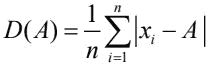
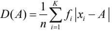
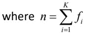
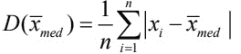
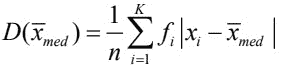

# 使用 NumPy | Python 的绝对偏差和绝对平均偏差

> 原文:[https://www . geeksforgeeks . org/绝对偏差和绝对平均偏差-使用-numpy-python/](https://www.geeksforgeeks.org/absolute-deviation-and-absolute-mean-deviation-using-numpy-python/)

**绝对值:**
[绝对值](https://en.wikipedia.org/wiki/Absolute_value)或实数 x 的模是 x 的非负值，与符号无关。例如，7 的绝对值是 7，而-7 的绝对值也是 7。

**偏差:**
偏差是对一个变量的观测值和其他值(通常是该变量的平均值)之间差异的度量。

**绝对偏差:**
数据集中某个元素的绝对偏差是该元素与给定点之间的绝对差值。观测值的绝对偏差 X1，X2，X3，…..，围绕值 A 的 Xn 定义为–

对于离散(未分组)数据-


对于连续(未分组)数据-



**绝对平均偏差:**
绝对平均偏差以绝对偏差的形式衡量数据的分布和分散性，最好是中间值。观测值 X1，X2，X3，……，Xn 的绝对偏差在中位数附近测量时最小，即 A 是数据的中位数。然后，如此获得的绝对偏差被称为绝对平均偏差，并被定义为:

对于离散(未分组)数据–


对于连续(未分组)数据–



**决策:**

1.  具有较高绝对平均偏差(或绝对偏差)值的数据集具有更大的可变性。
2.  具有较低绝对平均偏差(或绝对偏差)值的数据集是优选的。
    –>如果有两个数据集具有绝对平均值 AMD1 和 AMD2，以及 AMD1 > AMD2，那么 AMD1 中的数据据说比 AMD2 中的数据具有更大的可变性。

**示例:**
以下是过去 20 天内每天报名参加 GeeksforGeeks -DS & Algo 课程的考生人数–
75、69、56、46、47、79、92、97、89、88、36、96、105、32、116、101、79、93、91、112

**代码#1:** 使用 numpy 的绝对偏差

```py
# Importing mean, absolute from numpy
from numpy import mean, absolute

data = [75, 69, 56, 46, 47, 79, 92, 97, 89, 88,
        36, 96, 105, 32, 116, 101, 79, 93, 91, 112]

# Assume any point A about which 
# absolute deviation is to be calculated
A = 79

sum = 0  # Initialize sum to 0

# Absolute deviation calculation

for i in range(len(data)):
    av = absolute(data[i] - A)   # Absolute value of the differences 
                                 # of each data point and A

    # Summing all those absolute values
    sum = sum + av               

# Sum divided by length of data yields
# the absolute deviation
print(sum / len(data))             
```

**输出:**

```py
20.15
```

**代码#2:** 使用 numpy 的绝对平均偏差

```py
# Importing mean, absolute from numpy
from numpy import mean, absolute

data = [75, 69, 56, 46, 47, 79, 92, 97, 89, 88, 
        36, 96, 105, 32, 116, 101, 79, 93, 91, 112]

# Absolute mean deviation
mean(absolute(data - mean(data)))
```

**输出:**

```py
20.055
```

**代码#3:** 使用熊猫的绝对平均偏差

```py
# Import the pandas library as pd
import pandas as pd

data = [75, 69, 56, 46, 47, 79, 92, 97, 89, 88,
        36, 96, 105, 32, 116, 101, 79, 93, 91, 112]

# Creating data frame of the given data
df = pd.DataFrame(data)

# Absolute mean deviation
df.mad()    # mad() is mean absolute deviation function
```

**输出:**

```py
20.055
```