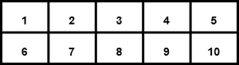

# NumPy 阵列基础知识

> 原文:[https://www.geeksforgeeks.org/basics-of-numpy-arrays/](https://www.geeksforgeeks.org/basics-of-numpy-arrays/)

[**NumPy**](https://www.geeksforgeeks.org/python-numpy/) 代表数值巨蟒。这是一个用于处理数组的 Python 库。在 Python 中，我们使用列表作为数组的目的，但是处理速度很慢。NumPy 数组是一个强大的 N 维数组对象，它在线性代数、傅立叶变换和随机数功能中的使用。它提供的数组对象比传统的 Python 列表快得多。

#### **数组类型:**

1.  一维数组
2.  多维数组

#### 一维阵列:

一维阵列是一种线性阵列。


**一维数组**

**示例:**

## 蟒蛇 3

```
# importing numpy module
import numpy as np

# creating list
list = [1, 2, 3, 4]

# creating numpy array
sample_array = np.array(list1)

print("List in python : ", list)

print("Numpy Array in python :",
      sample_array)
```

**输出:**

```
List in python :  [1, 2, 3, 4]
Numpy Array in python :  [1 2 3 4]
```

检查列表和数组的数据类型:

## 蟒蛇 3

```
print(type(list_1))

print(type(sample_array))
```

**输出:**

```
<class 'list'>
<class 'numpy.ndarray'>
```

#### 多维数组:

多维数组中的数据以表格形式存储。



**二维阵列**

**示例:**

## 蟒蛇 3

```
# importing numpy module
import numpy as np

# creating list
list_1 = [1, 2, 3, 4]
list_2 = [5, 6, 7, 8]
list_3 = [9, 10, 11, 12]

# creating numpy array
sample_array = np.array([list_1,
                         list_2,
                         list_3])

print("Numpy multi dimensional array in python\n",
      sample_array)
```