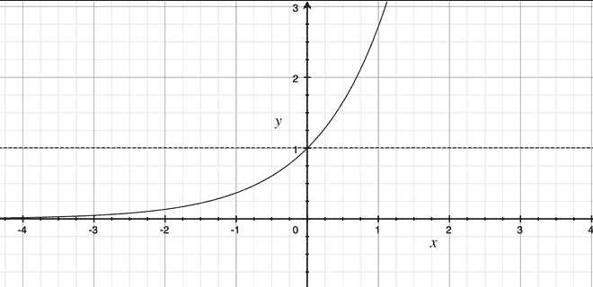

# 计算给定 NumPy 数组中所有元素的 exp(x)–1

> 原文:[https://www . geeksforgeeks . org/calculate-expx-1-for-all-elements-in-给定-numpy-array/](https://www.geeksforgeeks.org/calculate-expx-1-for-all-elements-in-a-given-numpy-array/)

**指数函数** (e^x)是一个数学函数，计算 e 的 x 次方，其中 e 是无理数，约为 2.71828183。



可以使用 [numpy.exp()](https://www.geeksforgeeks.org/numpy-exp-python/) 方法计算。这个数学函数帮助用户计算输入数组中所有元素的指数。

> **语法:** numpy.exp(arr，out，where)
> 
> **参数:**
> **arr :** 输入
> **输出:**存储结果的位置。如果提供，它必须具有
> 输入广播到的形状。如果未提供或无，则返回新分配的数组。
> 形状必须与输入数组相同。
> **其中:**布尔值。真值表示计算该位置的通用函数(ufunc)，假值表示将值单独留在输出中。

如果将标量作为输入提供给函数，则函数将应用于该标量，并返回另一个标量。

**示例 1:** 如果给出 3 作为输入，那么 e^3 将作为输出返回。

## 计算机编程语言

```py
import numpy

n = 4
print(numpy.exp(n))

n = 5
print(numpy.exp(n))
```

**输出:**

```py
54.598150033144236
148.4131591025766
```

如果输入是数组，则按元素应用函数。ex- np.exp([1，2，3])相当于[np.exp(1)，np.exp(2)，np.exp(3)]

**方法 1:迭代数组**

## 计算机编程语言

```py
# importing numpy
import numpy

arr = [1, 2, 3, 4]

print("Input : ", arr)
for i in range(len(arr)):
    arr[i] = numpy.exp(arr[i])-1

print("Output : ", arr)

arr = [3, 0.3, 3.1, 2.2]

print("Input : ", arr)
for i in range(len(arr)):
    arr[i] = numpy.exp(arr[i])-1

print("Output : ", arr)
```

**输出:**

> 输入:[1，2，3，4]
> 输出:[1.718281828459045，6.38905609893065，19.085536923187668，53.598150033144236]
> 输入:[3，0.3，3.1，2.2]
> 输出:[19.0850606000606

**方法二:提供数组作为 numpy.exp()函数的输入**

## 计算机编程语言

```py
# importing numpy
import numpy

arr = [1, 2, 3, 4]

print("Input : ", arr)

arr = numpy.exp(arr)-1
print("Output : ", arr)

arr = [3, 0.3, 3.1, 2.2]

print("Input : ", arr)

arr = numpy.exp(arr)-1
print("Output : ", arr)
```

**输出:**

> 输入:【1，2，3，4】
> 输出:【1.71828183 6.3890561 19.08553692 53.59815003】
> 输入:【3，0.3，3.1，2.2】
> 输出:【19.0853692 0.34985881 21.191288.020135】