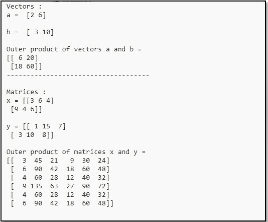
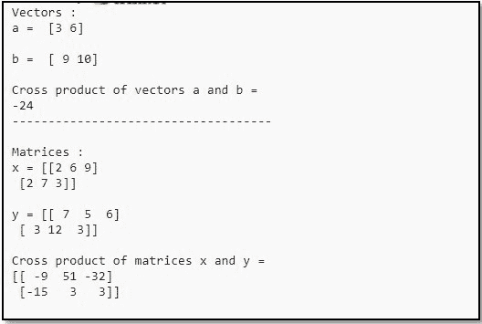

# 使用 NumPy

计算矩阵和向量的内积、外积和叉积

> 原文:[https://www . geeksforgeeks . org/compute-in-external-and-cross-乘积矩阵和向量-使用-numpy/](https://www.geeksforgeeks.org/calculate-inner-outer-and-cross-products-of-matrices-and-vectors-using-numpy/)

我们来讨论一下如何用 Python 中的 [NumPy](https://www.geeksforgeeks.org/python-numpy/) 来求矩阵和向量的内积、外积和叉积。

**向量和矩阵的内积**

求向量和矩阵的内积，可以用 NumPy 的 [**【内积()**](https://www.geeksforgeeks.org/numpy-inner-in-python/) 方法。
**语法:**

```
numpy.inner(arr1, arr2)
```

**代码:**

## 蟒蛇 3

```
# Python Program illustrating
# numpy.inner() method
import numpy as np

# Vectors
a = np.array([2, 6])
b = np.array([3, 10])
print("Vectors :")
print("a = ", a)
print("\nb = ", b)

# Inner Product of Vectors
print("\nInner product of vectors a and b =")
print(np.inner(a, b))

print("---------------------------------------")

# Matrices
x = np.array([[2, 3, 4], [3, 2, 9]])
y = np.array([[1, 5, 0], [5, 10, 3]])
print("\nMatrices :")
print("x =", x)
print("\ny =", y)

# Inner product of matrices
print("\nInner product of matrices x and y =")
print(np.inner(x, y))
```

**输出:**


**向量和矩阵的外积**

向量和矩阵的外积可以用 NumPy 的 [**【外()**](https://www.geeksforgeeks.org/numpy-outer-function-python/) 方法求出。
**语法:**

```
numpy.outer(a, b, out = None)
```

**代码:**

## 蟒蛇 3

```
# Python Program illustrating 
# numpy.outer() method 
import numpy as np

# Vectors
a = np.array([2, 6])
b = np.array([3, 10])
print("Vectors :")
print("a = ", a)
print("\nb = ", b)

# Outer product of vectors 
print("\nOuter product of vectors a and b =")
print(np.outer(a, b))

print("------------------------------------")

# Matrices
x = np.array([[3, 6, 4], [9, 4, 6]])
y = np.array([[1, 15, 7], [3, 10, 8]])
print("\nMatrices :")
print("x =", x)
print("\ny =", y)

# Outer product of matrices
print("\nOuter product of matrices x and y =")
print(np.outer(x, y))
```

**输出:**



**向量和矩阵的叉积**

为了找到向量和矩阵的叉积，我们可以使用 NumPy 的 **cross()** 方法。

**语法:**

```
numpy.cross(a, b)
```

**代码:**

## 蟒蛇 3

```
# Python Program illustrating 
# numpy.cross() method 
import numpy as np

# Vectors
a = np.array([3, 6])
b = np.array([9, 10])
print("Vectors :")
print("a = ", a)
print("\nb = ", b)

# Cross product of vectors 
print("\nCross product of vectors a and b =")
print(np.cross(a, b))

print("------------------------------------")

# Matrices
x = np.array([[2, 6, 9], [2, 7, 3]])
y = np.array([[7, 5, 6], [3, 12, 3]])
print("\nMatrices :")
print("x =", x)
print("\ny =", y)

# Cross product of matrices
print("\nCross product of matrices x and y =")
print(np.cross(x, y))
```

**输出:**

