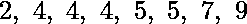
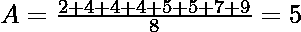
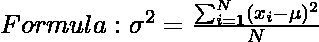
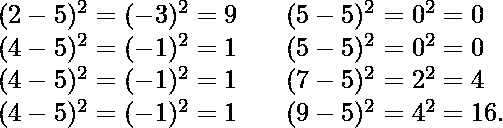
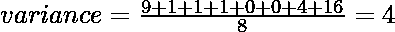
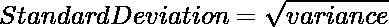
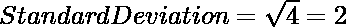

# 使用 NumPy

计算 Python 中的平均值、方差和标准差

> 原文:[https://www . geeksforgeeks . org/使用-numpy/](https://www.geeksforgeeks.org/calculate-the-average-variance-and-standard-deviation-in-python-using-numpy/) 计算 python 中的平均方差和标准偏差

[**Python 中的 Numpy**](https://www.geeksforgeeks.org/python-programming-language/#Numpy) 是一个通用的数组处理包。它提供了一个高性能多维数组对象和使用这些数组的工具。它是使用 Python 进行科学计算的基本包。Numpy 提供了非常简单的方法来计算平均值、方差和标准差。

## 平均的

对一组数据中表示中心值或典型值的数字求平均值，特别是众数、中位数或(最常见的)平均数，其计算方法是将数据集中的值之和除以它们的数字。n 个数 x <sub>1</sub> ，x <sub>2</sub> ，……x <sub>n</sub> 的平均值的基本公式为


**示例:**

假设有 8 个数据点，



这 8 个数据点的平均值是，



#### Python 中使用 Numpy 的平均值:

可以使用 python 中的 **numpy.average()** 函数计算平均值。

> **语法:**
> 
> **numpy . average(**)T2 a**、** *轴=None* **、** *权重=None* **、** *返回=False* **)**
> 
> **参数:**
> 
> **a:** 包含要求平均值的数据的数组
> 
> **轴:**轴或平均 *a* 的轴
> 
> **权重:** 与 *a* 中的值相关联的权重数组
> 
> ***返回:*** 默认为*假*。如果*为真*，则返回元组，否则只返回平均值

**例 1:**

## 计算机编程语言

```
# Python program to get average of a list

# Importing the NumPy module
import numpy as np

# Taking a list of elements
list = [2, 4, 4, 4, 5, 5, 7, 9]

# Calculating average using average()
print(np.average(list))
```

**输出:**

```
5.0
```

**例 2:**

## 计算机编程语言

```
# Python program to get average of a list

# Importing the NumPy module
import numpy as np

# Taking a list of elements
list = [2, 40, 2, 502, 177, 7, 9]

# Calculating average using average()
print(np.average(list))
```

**输出:**

```
105.57142857142857
```

## 差异

方差是所有数字和平均值之间差异的平方和。方差的数学公式如下:



> **在哪里，**
> 
> ？意思是，
> 
> n 是元素总数或分布频率。

**示例:**

让我们考虑一下我们取平均值的同一个数据集。首先，计算每个数据点与平均值的偏差，并对每个结果进行平方，




#### Python 中使用 Numpy 的差异:

可以使用 python 中的 **numpy.var()** 函数计算方差。

> **语法:**
> 
> **num py . var(***【a】***、***【axis = none】**、***【dttype = none】***、***
> 
> ****参数:****
> 
> ****a:** 包含要求平均值的数据的数组**
> 
> ****轴:**轴或平均 *a* 的轴**
> 
> *****数据类型:*** 用于计算方差的类型。**
> 
>  ****out:** 放置结果的备用输出数组。
> 
> **自由度:**δ自由度
> 
> **保持尺寸:**如果设置为真，减少的轴将作为尺寸为 1 的尺寸留在结果中**

****例 1:****

## **计算机编程语言**

```
# Python program to get variance of a list

# Importing the NumPy module
import numpy as np

# Taking a list of elements
list = [2, 4, 4, 4, 5, 5, 7, 9]

# Calculating variance using var()
print(np.var(list))
```

****输出:****

```
4.0
```

****例 2:****

## **计算机编程语言**

```
# Python program to get variance of a list

# Importing the NumPy module
import numpy as np

# Taking a list of elements
list = [212, 231, 234, 564, 235]

# Calculating variance using var()
print(np.var(list))
```

****输出:****

```
18133.359999999997
```

## **标准偏差**

**标准差是方差的平方根。这是衡量数据偏离平均值的程度。计算标准差的数学公式如下:**

**** 

****示例:****

**上述数据的标准偏差，**

****

#### **Python 中使用 Numpy 的标准偏差:**

**可以使用 python 中的 **numpy.std()** 函数计算标准差。**

> ****语法:****
> 
> ****numpy . STD(**)T2 a**、** *轴=None* **、** *dtype=None* **、** *out=None* **、** *ddof=0* **、***keepdims =<no value>***)****
> 
> ****参数:****
> 
> ****a:** 包含要求平均值的数据的数组**
> 
> ****轴:**轴或平均 *a* 的轴**
> 
> *****数据类型:*** 用于计算方差的类型。**
> 
> ****out:** 放置结果的备用输出数组。**
> 
> ****自由度:**δ自由度**
> 
> ****保持尺寸:**如果设置为真，减少的轴将作为尺寸为 1 的尺寸留在结果中**

****例 1:****

## **计算机编程语言**

```
# Python program to get
# standard deviation of a list

# Importing the NumPy module
import numpy as np

# Taking a list of elements
list = [2, 4, 4, 4, 5, 5, 7, 9]

# Calculating standard
# deviation using var()
print(np.std(list))
```

****输出:****

```
2.0
```

****例 2:****

## **计算机编程语言**

```
# Python program to get
# standard deviation of a list

# Importing the NumPy module
import numpy as np

# Taking a list of elements
list = [290, 124, 127, 899]

# Calculating standard
# deviation using var()
print(np.std(list))
```

****输出:****

```
318.35750344541907
```