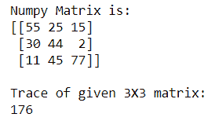
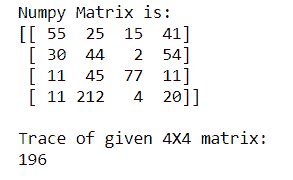
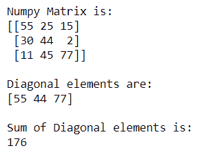
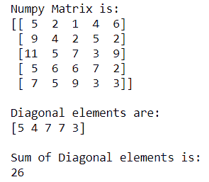

# 计算 NumPy 数组对角线元素的和

> 原文:[https://www . geeksforgeeks . org/计算 numpy 数组的对角线元素之和/](https://www.geeksforgeeks.org/calculate-the-sum-of-the-diagonal-elements-of-a-numpy-array/)

有时我们需要找到右上角、左上角、右下角或左下角对角线元素的总和。Numpy 为我们提供了使用 numpy.trace()和 **numpy .对角线()**方法计算不同对角线元素之和的工具。

**方法 1:** 使用 **numpy.trace()** 求对角线元素的和

> **语法:** numpy.trace(a，offset=0，axis1=0，axis2=1，dtype=None，out=None)

**例 1:** 为 **3X3 Numpy 矩阵**

## 蟒蛇 3

```
# importing Numpy package
import numpy as np

# creating a 3X3 Numpy matrix
n_array = np.array([[55, 25, 15],
                    [30, 44, 2],
                    [11, 45, 77]])

# Displaying the Matrix
print("Numpy Matrix is:")
print(n_array)

# calculating the Trace of a matrix
trace = np.trace(n_array)

print("\nTrace of given 3X3 matrix:")
print(trace)
```

**输出:**



**示例 2:** 用于 **4X4 Numpy 矩阵**

## 蟒蛇 3

```
# importing Numpy package
import numpy as np

# creating a 4X4 Numpy matrix
n_array = np.array([[55, 25, 15, 41],
                    [30, 44, 2, 54],
                    [11, 45, 77, 11],
                    [11, 212, 4, 20]])

# Displaying the Matrix
print("Numpy Matrix is:")
print(n_array)

# calculating the Trace of a matrix
trace = np.trace(n_array)

print("\nTrace of given 4X4 matrix:")
print(trace)
```

**输出:**



**方法 2:** 使用 **numpy .对角线()**求对角线元素的和

**语法:**

```
numpy.diagonal(a, offset=0, axis1=0, axis2=1

```

**例 1:** 为 **3X3 Numpy 矩阵**

## 蟒蛇 3

```
# importing Numpy package
import numpy as np

# creating a 3X3 Numpy matrix
n_array = np.array([[55, 25, 15],
                    [30, 44, 2],
                    [11, 45, 77]])

# Displaying the Matrix
print("Numpy Matrix is:")
print(n_array)

# Finding the diagonal elements of a matrix
diag = np.diagonal(n_array)

print("\nDiagonal elements are:")
print(diag)

print("\nSum of Diagonal elements is:")
print(sum(diag))
```

**输出:**



**例 2:** 适用于 **5X5 Numpy 矩阵**

## 蟒蛇 3

```
# importing Numpy package
import numpy as np

# creating a 5X5 Numpy matrix
n_array = np.array([[5, 2, 1, 4, 6],
                    [9, 4, 2, 5, 2],
                    [11, 5, 7, 3, 9],
                    [5, 6, 6, 7, 2],
                    [7, 5, 9, 3, 3]])

# Displaying the Matrix
print("Numpy Matrix is:")
print(n_array)

# Finding the diagonal elements of a matrix
diag = np.diagonal(n_array)

print("\nDiagonal elements are:")
print(diag)

print("\nSum of Diagonal elements is:")
print(sum(diag))
```

**输出:**

