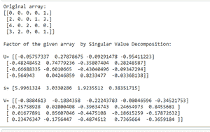
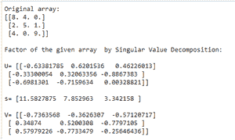
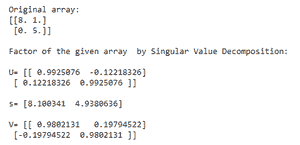

# 使用 NumPy

通过奇异值分解计算给定数组的因子

> 原文:[https://www . geeksforgeeks . org/用-numpy/](https://www.geeksforgeeks.org/compute-the-factor-of-a-given-array-by-singular-value-decomposition-using-numpy/) 通过奇异值分解计算给定数组的因子

**奇异值分解**是指当 **arr** 为 2D 阵时，分解为 **u** 和 **vh** ，其中 **u** 和 **vh** 为 **2D 酉阵**， **s** 为 a 的奇异值的 **1D 阵**。***numpy . linalg . SVD()***函数用于通过奇异值分解计算数组的因子。

> **语法:** numpy.linalg.svd(a，full _ matrices = True，compute_uv=True，hermitian=False)
> 
> **参数:**
> 
> *   **a (…，M，N)数组:**A . ndim>= 2 的实数组或复数组。
> *   **full _ matrix(bool，可选):**如果为真(默认)，u 和 vh 分别具有形状(…，M，M)和(…，N，N)。否则，形状分别为(…，M，K)和(…，K，N)，其中 K = min(M，N)。
> *   **compute_uv(bool，可选):**除 s 外是否计算 u 和 vh，默认值为 True。
> *   **hermitian(bool，可选):**如果为 True，则假设 a 为 hermitian(如果实值，则为对称)，这为寻找奇异值提供了更有效的方法。其默认值为“假”。

下面是一些如何使用该函数的示例:

**例 1 :**

## 蟒蛇 3

```py
# Import numpy library
import numpy as np

# Create a numpy array
arr = np.array([[0, 0, 0, 0, 1], [2, 0, 0, 1, 3],
                [4, 0, 2, 0, 0], [3, 2, 0, 0, 1]],
               dtype=np.float32)

print("Original array:")
print(arr)

# Compute the factor by Singular Value 
# Decomposition
U, s, V = np.linalg.svd(arr, full_matrices=False)

# Print the result
print("\nFactor of the given array  by Singular Value Decomposition:")
print("\nU=", U, "\n\ns=", s, "\n\nV=", V)
```

**输出:**



**例 2 :**

## 蟒蛇 3

```py
# Import numpy library
import numpy as np

# Create a numpy array
arr = np.array([[8, 4, 0], [2, 5, 1], 
                [4, 0, 9]], dtype=np.float32)

print("Original array:")
print(arr)

# Compute the factor 
U, s, V = np.linalg.svd(arr, full_matrices=False)

# Print the result
print("\nFactor of the given array  by Singular Value Decomposition:")
print("\nU=", U, "\n\ns=", s, "\n\nV=", V)
```

**输出:**



**例 3 :**

## 蟒蛇 3

```py
# Import numpy library
import numpy as np

# Create a numpy array
arr = np.array([[8, 1], [0, 5]], dtype=np.float32)
print("Original array:")
print(arr)

# Compute the factor 
U, s, V = np.linalg.svd(arr, full_matrices=False)

# Print the result
print("\nFactor of the given array  by Singular Value Decomposition:")
print("\nU=", U, "\n\ns=", s, "\n\nV=", V)
```

**输出:**

