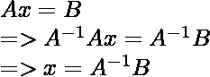

# 使用 NumPy

计算矩阵的逆矩阵

> 原文:[https://www . geeksforgeeks . org/compute-the-of-matrix-use-numpy/](https://www.geeksforgeeks.org/compute-the-inverse-of-a-matrix-using-numpy/)

矩阵的逆只是矩阵的倒数，就像我们在普通算术中对一个数所做的那样，这个数被用来解方程以找到未知变量的值。矩阵的逆矩阵是与原矩阵相乘后得到的单位矩阵。矩阵的逆只有在矩阵为**非奇异时才存在，即行列式不应为 0** 。利用行列式和伴随式，我们可以很容易地用下面的公式求出方阵的逆矩阵，

```
if det(A) != 0
    A-1 = adj(A)/det(A)
else
    "Inverse doesn't exist"  

```

<center>

#### 矩阵方程



</center>

> ***在哪里，***
> 
> ***A <sup>-1</sup> :** 矩阵 A 的逆*
> 
> ***x:** 未知变量列*
> 
> *T1】B:解矩阵*

我们可以用函数 numpy.linalg.inv(array)求任意方阵的逆。

> **语法:** numpy.linalg.inv(a)
> 
> ***参数:***
> 
> ***a:** 待倒矩阵*
> 
> ***返回:**矩阵的逆 a.*

**例 1:**

## 蟒蛇 3

```
# Importing Library
import numpy as np

# Finding an inverse of given array
arr = np.array([[1, 2], [5, 6]])
inverse_array = np.linalg.inv(arr)
print("Inverse array is ")
print(inverse_array)
print()

# inverse of 3X3 matrix
arr = np.array([[1, 2, 3], 
                [4, 9, 6], 
                [7, 8, 9]])

inverse_array = np.linalg.inv(arr)
print("Inverse array is ")
print(inverse_array)
print()

# inverse of 4X4 matrix
arr = np.array([[1, 2, 3, 4], 
                [10, 11, 14, 25],
                [20, 8, 7, 55], 
                [40, 41, 42, 43]])

inverse_array = np.linalg.inv(arr)
print("Inverse array is ")
print(inverse_array)
print()

# inverse of 1X1 matrix
arr = np.array([[1]])
inverse_array = np.linalg.inv(arr)
print("Inverse array is ")
print(inverse_array)
```

**输出:**

```
Inverse array is 
[[-1.5   0.5 ]
 [ 1.25 -0.25]]

Inverse array is 
[[-0.6875     -0.125       0.3125    ]
 [-0.125       0.25       -0.125     ]
 [ 0.64583333 -0.125      -0.02083333]]

Inverse array is 
[[-15.07692308   4.9         -0.8         -0.42307692]
 [ 32.48717949 -10.9          1.8          1.01282051]
 [-20.84615385   7.1         -1.2         -0.65384615]
 [  3.41025641  -1.1          0.2          0.08974359]]

Inverse array is 
[[1.]]

```

**例 2:**

## 蟒蛇 3

```
# Import required package 
import numpy as np 

# Inverses of several matrices can 
# be computed at once 
A = np.array([[[1., 2.], [3., 4.]], 
              [[1, 3], [3, 5]]]) 

# Calculating the inverse of the matrix 
print(np.linalg.inv(A))
```

**输出:**

```
[[[-2\.    1\.  ]
  [ 1.5  -0.5 ]]

 [[-1.25  0.75]
  [ 0.75 -0.25]]]

```