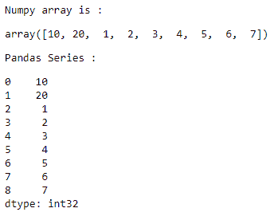
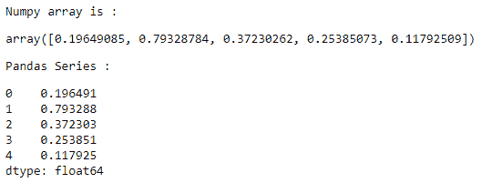

# 将 NumPy 数组转换为熊猫系列

> 原文:[https://www . geeksforgeeks . org/convert-a-numpy-array-to-a-pandas-series/](https://www.geeksforgeeks.org/convert-a-numpy-array-to-a-pandas-series/)

让我们看看如何将 NumPy 数组转换为 Pandas 系列。通过在 **`pandas.Series()`** 函数中传递一个 NumPy 数组，可以将其转换为熊猫系列。

**例 1 :**

```py
# importing the modules
import numpy as np
import pandas as pd

# creating an NumPy array
array = np.array([10, 20, 1, 2, 
                   3, 4, 5, 6, 7])

# displaying the NumPy array
print("Numpy array is :")
display(array)

# converting the NumPy array 
# to a Pandas series
series = pd.Series(array) 

# displaying the Pandas series
print("Pandas Series : ")
display(series)
```

**输出:**


**例 2 :**

```py
# importing the modules
import numpy as np
import pandas as pd

# creating an NumPy array
array = np.random.rand(5) 

# displaying the NumPy array
print("Numpy array is :")
display(array)

# converting the NumPy array 
# to a Pandas series
series = pd.Series(array) 

# displaying the Pandas series
print("Pandas Series : ")
display(series)
```

**输出:**
