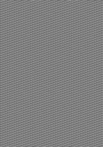

# 将 NumPy 数组转换为图像

> 原文:[https://www . geeksforgeeks . org/convert-a-numpy-array-to-a-image/](https://www.geeksforgeeks.org/convert-a-numpy-array-to-an-image/)

[**NumPy**](https://www.geeksforgeeks.org/python-numpy/) 或者数字 python 是一个流行的数组操作库。因为图像只是携带各种颜色代码的像素阵列。NumPy 可用于将数组转换为图像。除了 NumPy 之外，我们还将使用[*【PIL】*](https://www.geeksforgeeks.org/working-images-python/)或 Python 图像库(也称为抱枕)来操作和保存数组。

**进场:**

1.  创建 numpy 数组。
2.  将上述阵列重新调整到合适的尺寸。
3.  使用 PIL 库从上面的数组创建一个图像对象。
4.  以合适的文件格式保存图像对象。

下面是实现:

## 蟒蛇 3

```
# Python program to convert
# numpy array to image

# import required libraries
import numpy as np
from PIL import Image as im

# define a main function
def main():

    # create a numpy array from scratch
    # using arange function.
    # 1024x720 = 737280 is the amount 
    # of pixels.
    # np.uint8 is a data type containing
    # numbers ranging from 0 to 255 
    # and no non-negative integers
    array = np.arange(0, 737280, 1, np.uint8)

    # check type of array
    print(type(array))

    # our array will be of width 
    # 737280 pixels That means it 
    # will be a long dark line
    print(array.shape)

    # Reshape the array into a 
    # familiar resoluition
    array = np.reshape(array, (1024, 720))

    # show the shape of the array
    print(array.shape)

    # show the array
    print(array)

    # creating image object of
    # above array
    data = im.fromarray(array)

    # saving the final output 
    # as a PNG file
    data.save('gfg_dummy_pic.png')

# driver code
if __name__ == "__main__":

  # function call
  main()
```

**输出:**

```
<class 'numpy.ndarray'>
(737280,)
(1024, 720)
[[  0   1   2 ... 205 206 207]
 [208 209 210 ... 157 158 159]
 [160 161 162 ... 109 110 111]
 ...
 [144 145 146 ...  93  94  95]
 [ 96  97  98 ...  45  46  47]
 [ 48  49  50 ... 253 254 255]]

```



gfg_dummy_pic.png 1024 x 720

**注意:**每个数组都不能转换成图像，因为图像的每个像素都由特定的颜色代码组成，如果给定的数组格式不合适，库将无法正确处理它。