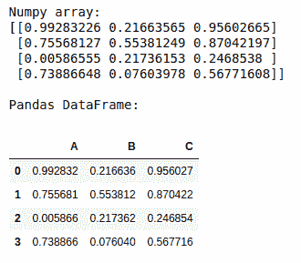
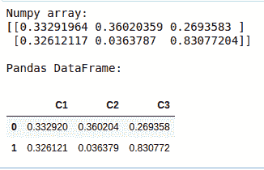
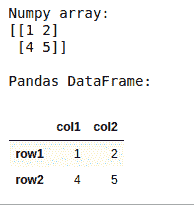

# 将 NumPy 数组转换为带有标题的熊猫数据帧

> 原文:[https://www . geeksforgeeks . org/convert-a-numpy-array-to-pandas-data frame-with-header/](https://www.geeksforgeeks.org/convert-a-numpy-array-to-pandas-dataframe-with-headers/)

要将 numpy 数组转换为熊猫数据帧，我们使用 **[熊猫。Python 熊猫库的](https://www.geeksforgeeks.org/python-pandas-dataframe/)** 功能。

> **语法:**熊猫。数据框(数据=无，索引=无，列=无)
> 
> **参数:**
> **数据:** numpy ndarray，dict 或 dataframe
> **索引:**结果数据帧的索引
> **列:**结果数据帧的列标签

**Example 1 :**

```py
import numpy as np
import pandas as pd

arr = np.random.rand(4, 3)
print("Numpy array:")
print(arr)

# convert numpy array to dataframe
df = pd.DataFrame(arr, columns =['A', 'B', 'C'])
print("\nPandas DataFrame: ")
df
```

**输出:**



**例 2 :**

```py
import numpy as np
import pandas as pd

arr = np.random.rand(6).reshape(2, 3)
print("Numpy array:")
print(arr)

# convert numpy array to dataframe
df = pd.DataFrame(arr, columns =['C1', 'C2', 'C3'])
print("\nPandas DataFrame: ")
df
```

**输出:**



**例 3 :**

```py
import numpy as np
import pandas as pd

arr = np.array([[1, 2], [4, 5]])
print("Numpy array:")
print(arr)

# convert numpy array to dataframe
df = pd.DataFrame(data = arr, index =["row1", "row2"], 
                  columns =["col1", "col2"])

print("\nPandas DataFrame: ")
df
```

**输出:**

