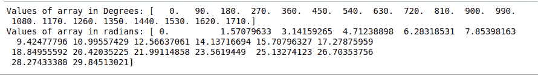

# 将给定 NumPy 数组中所有元素的角度从度转换为弧度

> 原文:[https://www . geeksforgeeks . org/convert-给定 numpy 数组中所有元素的角度-从度到弧度/](https://www.geeksforgeeks.org/convert-angles-from-degrees-to-radians-for-all-elements-in-a-given-numpy-array/)

角度可以用度数和弧度来表示。在本文中，我们将了解将度数转换为弧度的方法和途径。

**方法#1:使用** [**弧度()**](https://www.geeksforgeeks.org/degrees-and-radians-in-python/)

此方法将数组作为输入参数，并返回具有弧度值的数组。

## 计算机编程语言

```py
# python code demonstrating usage of radians
# method to convert degrees to radians
# importing numpy library
import numpy as np
import math

# initialising an array
array=np.arange(20.)*90

# printing degree values
print('Values of array in Degrees:',array)

# converting to radians
radian_array=np.radians(array)

# printing radian values
print('Values of array in radians:',radian_array)
```

**输出:**



**方法 2:使用** [**deg2rad()**](https://www.geeksforgeeks.org/numpy-radians-deg2rad-python/)

此方法采用输入数组，并返回一个弧度值与输入数组大小相同的数组。

## 蟒蛇 3

```py
# python code demonstrating usage of radians
# method to convert degrees to radians
# importing numpy library
import numpy as np
import math

# initialising an array
array=np.arange(20.)*90

# printing degree values
print('Values of array in Degrees:',array)

# converting to radians
radian_array=np.deg2rad(array)

# printing radian values
print('Values of array in radians:',radian_array)
```

**输出:**


**方法三:使用公式**

## 蟒蛇 3

```py
# python code demonstrating usage of radians
# method to convert degrees to radians
# importing numpy library
import numpy as np
import math

# initialising an array
array=np.arange(20.)*90

# printing degree values
print('Values of array in Degrees:',array)
radian_array=[]

# converting to radians
for i in array:
    radian_array.append(i*math.pi/180)

# printing radian values
print('Values of array in radians:',radian_array)
```

**输出:**

