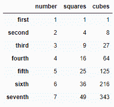
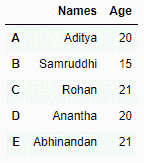

# 从 Numpy 数组创建数据框，并指定索引列和列标题

> 原文:[https://www . geeksforgeeks . org/create-a-data frame-from-a-numpy-array-and-specify-index-column-and-column-header/](https://www.geeksforgeeks.org/create-a-dataframe-from-a-numpy-array-and-specify-the-index-column-and-column-headers/)

让我们看看如何从 Numpy 数组创建一个数据帧。我们还将学习如何指定数据框的索引和列标题。

**进场:**

1.  导入`Pandas` 和`Numpy` 模块。
2.  创建一个`Numpy` 数组。
3.  为数据框创建索引值和列值列表。
4.  创建数据帧。
5.  显示数据框。

**例 1 :**

```
# importiong the modules
import pandas as pd
import numpy as np

# creating the Numpy array
array = np.array([[1, 1, 1], [2, 4, 8], [3, 9, 27], 
                  [4, 16, 64], [5, 25, 125], [6, 36, 216], 
                  [7, 49, 343]])

# creating a list of index names
index_values = ['first', 'second', 'third',
                'fourth', 'fifth', 'sixth', 'seventh']

# creating a list of column names
column_values = ['number', 'squares', 'cubes']

# creating the dataframe
df = pd.DataFrame(data = array, 
                  index = index_values, 
                  columns = column_values)

# displaying the dataframe
print(df)
```

**输出:**


**例 2 :**

```
# importiong the modules
import pandas as pd
import numpy as np

# creating the Numpy array
array = np.array([['Aditya', 20], ['Samruddhi', 15],
                  ['Rohan', 21], ['Anantha', 20], 
                  ['Abhinandan', 21]])

# creating a list of index names
index_values = ['A', 'B', 'C', 'D', 'E']

# creating a list of column names
column_values = ['Names', 'Age']

# creating the dataframe
df = pd.DataFrame(data = array, 
                  index = index_values, 
                  columns = column_values)

# displaying the dataframe
print(df)
```

**输出:**


**例 3 :**

```
# importiong the modules
import pandas as pd
import numpy as np

# creating the Numpy array
array = np.array([['CEO', 20, 5], ['CTO', 22, 4.5], 
                  ['CFO', 21, 3], ['CMO', 24, 2]])

# creating a list of index names
index_values = [1, 2, 3, 4]

# creating a list of column names
column_values = ['Names', 'Age', 
                 'Net worth in Millions']

# creating the dataframe
df = pd.DataFrame(data = array, 
                  index = index_values, 
                  columns = column_values)

# displaying the dataframe
print(df)
```

**输出:**
