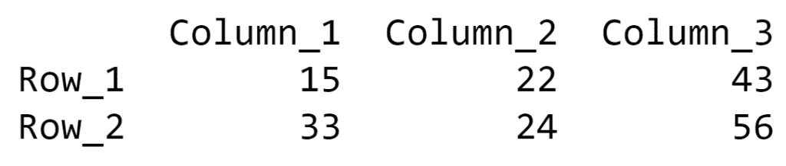

# 从 Numpy 数组创建 Pandas DataFrame，并指定索引列和列标题

> 原文:[https://www . geesforgeks . org/create-a-pandas-data frame-from-a-numpy-array-and-specify-index-column-and-column-header/](https://www.geeksforgeeks.org/create-a-pandas-dataframe-from-a-numpy-array-and-specify-the-index-column-and-column-headers/)

本文演示了多个示例来将 [Numpy](https://www.geeksforgeeks.org/python-numpy/) 数组转换为 [Pandas Dataframe](https://www.geeksforgeeks.org/python-pandas-dataframe/) 并指定数据帧的索引列和列标题。

**示例 1:** 在本例中，将生成 Pandas 数据框，并在函数中提到索引列和列标题的专有名称。当没有命名索引列或列标题的模式时，可以使用这种方法。

下面是实现:

## 蟒蛇 3

```py
# Python program to Create a 
# Pandas DataFrame from a Numpy  
# array and specify the index 
# column and column headers

# import required libraries
import numpy as np
import pandas as pd

# creating a numpy array
numpyArray = np.array([[15, 22, 43], 
                       [33, 24, 56]])

# generating the Pandas dataframe
# from the Numpy array and specifying
# name of index and columns
panda_df = pd.DataFrame(data = numpyArray, 
                        index = ["Row_1", "Row_2"], 
                        columns = ["Column_1",
                                   "Column_2", "Column_3"])

# printing the dataframe
print(panda_df)
```

**输出:**



**示例 2:** 在本例中，索引列和列标题通过迭代生成。行和列的迭代范围由 Numpy 数组的形状定义。每次迭代时，都会向预定义的字符串中添加一个数字，并生成新的索引列或列标题。因此，如果在命名数据帧的标签时有某种模式，这种方法是合适的。

下面是实现:

## 蟒蛇 3

```py
# Python program to Create a 
# Pandas DataFrame from a Numpy  
# array and specify the index column 
# and column headers

# import required libraries
import pandas as pd
import numpy as np

# creating a numpy array
numpyArray = np.array([[15, 22, 43], 
                       [33, 24, 56]])

# generating the Pandas dataframe
# from the Numpy array and specifying
# name of index and columns
panda_df = pd.DataFrame(data = numpyArray[0:, 0:],
                        index = ['Row_' + str(i + 1) 
                        for i in range(numpyArray.shape[0])],
                        columns = ['Column_' + str(i + 1) 
                        for i in range(numpyArray.shape[1])])

# printing the dataframe
print(panda_df)
```

**输出:**


**示例 3:** 在本例中，索引列和列标题是在将 Numpy 数组转换为 Pandas 数据帧之前定义的。标签名再次通过迭代生成，但是方法没有什么不同。这里，迭代次数由 Numpy 数组内部子数组的长度定义。如果索引列和列标题名称遵循某种模式，则可以使用此方法。

下面是实现:

## 蟒蛇 3

```py
# Python program to Create a 
# Pandas DataFrame from a Numpy  
# array and specify the index column 
# and column headers

# import required libraries
import pandas as pd
import numpy as np

# creating a numpy array
numpyArray = np.array([[15, 22, 43], 
                       [33, 24, 56]])

# defining index for the 
# Pandas dataframe
index = ['Row_' + str(i) 
        for i in range(1, len(numpyArray) + 1)]

# defining column headers for the 
# Pandas dataframe
columns = ['Column_' + str(i) 
          for i in range(1, len(numpyArray[0]) + 1)]

# generating the Pandas dataframe
# from the Numpy array and specifying
# details of index and column headers
panda_df = pd.DataFrame(numpyArray , 
                        index = index,
                        columns = columns)

# printing the dataframe
print(panda_df)
```

**输出:**


**示例#4:** 在这种方法中，Pandas 数据帧的索引列和列标题将出现在 Numpy 数组中。在将 Numpy 数组转换为 Pandas 数据帧的过程中，必须对 Numpy 数组的子数组进行适当的索引，以获得正确的数据帧标签序列。

下面是实现:

## 蟒蛇 3

```py
# Python program to Create a 
# Pandas DataFrame from a Numpy  
# array and specify the index column 
# and column headers

# import required libraries
import pandas as pd
import numpy as np

# creating a numpy array and
# specifying the index and 
# column headers along with 
# data stored in the array
numpyArray = np.array([['', 'Column_1', 
                       'Column_2', 'Column_3'],
                       ['Row_1', 15, 22, 43],
                       ['Row_2', 33, 24, 56]])

# generating the Pandas dataframe
# from the Numpy array and specifying
# details of index and column headers
panda_df = pd.DataFrame(data = numpyArray[1:, 1:],
                        index = numpyArray[1:, 0],
                        columns = numpyArray[0, 1:])

# printing the dataframe
print(panda_df)
```

**输出:**

