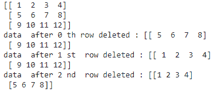

# 删除 NumPy 数组的行和列

> 原文:[https://www . geesforgeks . org/delete-row-and-columns-of-numpy-ndarray/](https://www.geeksforgeeks.org/delete-rows-and-columns-of-numpy-ndarray/)

在本文中，我们将讨论如何删除 n 维数组中指定的行和列。我们将使用 **numpy.delete()** 方法删除行和列。

> **语法:** numpy.delete(array_name，obj，axis=None)

让我们借助一些例子来讨论一下:

**例 1:**

用 NumPy 创建一个二维数组(3 行 4 列)并删除指定的行。

## 蟒蛇 3

```
# importing numpy module
import numpy as np

# create an array with integers
# with 3 rows and 4 columns
a = np.array([[1, 2, 3, 4],
              [5, 6, 7, 8], 
              [9, 10, 11, 12]])
print(a)

# delete 0 th row
data = np.delete(a, 0, 0)
print("data  after 0 th row deleted :", data)

# delete 1 st row
data = np.delete(a, 1, 0)
print("data  after 1 st  row deleted :", data)

# delete 2 nd row
data = np.delete(a, 2, 0)
print("data  after 2 nd  row deleted :", data)
```

**输出:**



**例 2:**

用 NumPy 创建一个二维数组(6 行 2 列)并删除指定的列。

## 蟒蛇 3

```
# importing numpy module
import numpy as np

# create an array with integers with
# 6 rows and 2 columns
a = np.array([[1, 2], [5, 6], [9, 10, ],
              [78, 90], [4, 89], [56, 43]])
print(a)

# delete 0 th column
data = np.delete(a, 0, 1)
print("data  after 0 th  column  deleted :", data)

# delete 1 st column
data = np.delete(a, 1, 1)
print("data  after 1 st  column  deleted :", data)
```