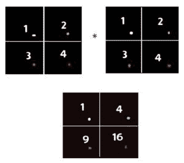

# Python 中 NumPy.dot()和' * '运算的区别

> 原文:[https://www . geesforgeks . org/numpy-dot-and-operation-in-python/](https://www.geeksforgeeks.org/difference-between-numpy-dot-and-operation-in-python/)

在 Python 中，如果我们有两个通常被称为向量的 numpy 数组。“*”运算符和 numpy.dot()对它们的作用不同。了解这一点很重要，尤其是当你处理数据科学或竞争性编程问题时。

### “*”运算符的工作原理

*”操作在数组元素上执行逐元素乘法。a[i][j]处的元素乘以 b[i][j]。这发生在数组的所有元素上。
**例:**

```
Let the two 2D array are v1 and v2:-
v1 = [[1, 2], [3, 4]]
v2 = [[1, 2], [3, 4]]

Output:
[[1, 4]
[9, 16]]
From below picture it would be clear.
```



### numpy.dot()的工作原理

它带有正规矩阵乘法。如果第一个数组的列数应等于第二个数组的行数，则只检查 numpy.dot()函数，否则会显示错误。
**例:**

```
Let the two 2D array are v1 and v2:-
v1=[[1, 2], [3, 4]]
v2=[[1, 2], [3, 4]]
Than numpy.dot(v1, v2)  gives output of :-
[[ 7 10]
 [15 22]]
```

**例 1:**

## 蟒蛇 3

```
import numpy as np

# vector v1 of dimension (2, 2)
v1 = np.array([[1, 2], [1, 2]])

# vector v2 of dimension (2, 2)
v2 = np.array([[1, 2], [1, 2]])

print("vector multiplication")
print(np.dot(v1, v2))

print("\nElementwise multiplication of two vector")
print(v1 * v2)
```

```
Output :
vector multiplication
[[3 6]
 [3 6]]

Elementwise multiplication of two vector
[[1 4]
 [1 4]]
```

**例 2:**

## 蟒蛇 3

```
import numpy as np

v1 = np.array([[1, 2, 3], [1, 2, 3], [1, 2, 3]])

v2 = np.array([[[1, 2, 3], [1, 2, 3], [1, 2, 3]]])

print("vector multiplication")
print(np.dot(v1, v2))

print("\nElementwise multiplication of two vector")
print(v1 * v2)
```

```
Output :
vector multiplication
[[ 6 12 18]
 [ 6 12 18]
 [ 6 12 18]]

Elementwise multiplication of two vector
[[1 4 9]
 [1 4 9]
 [1 4 9]]
```