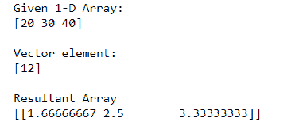
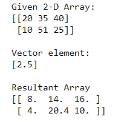
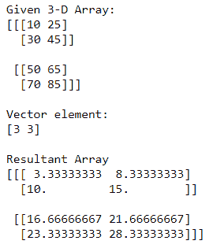

# 使用 NumPy

将每行除以一个向量元素

> 原文:[https://www . geeksforgeeks . org/使用-numpy/](https://www.geeksforgeeks.org/divide-each-row-by-a-vector-element-using-numpy/) 将每行除以一个向量元素

**先决条件:** [Numpy 模块](https://www.geeksforgeeks.org/python-numpy/)

下面的文章描述了 Numpy 数组的行如何被向量元素划分。向量元素可以是单个元素、多个元素或数组。使用除法运算符( **/** )来产生所需的功能。我们可以使用向量元素来划分一维、二维甚至更多类型的数组的行，下面的示例将帮助您更好地理解:

**例 1:**

## 蟒蛇 3

```
# Importing Numpy module 
import numpy as np

# Creating 1-D Numpy array
n_arr = np.array([20, 30, 40])
print("Given 1-D Array:")
print(n_arr)

# Vector element 
vec = np.array([12])
print("\nVector element:")
print(vec)

# Dividing rows of 1-D array with vector element
print("\nResultant Array")
print(n_arr / vec[:,None])
```

**输出:**



在上面的例子中，我们用向量元素来划分 **1-D** Numpy 数组的行，即**【15】**

**例 2:**

## 蟒蛇 3

```
# Importing Numpy module 
import numpy as np

# Creating 2-D Numpy array
n_arr = np.array([[20, 35, 40],
                [10, 51, 25]])

print("Given 2-D Array:")
print(n_arr)

# Vector element 
vec = np.array([2.5])
print("\nVector element:")
print(vec)

# Dividing rows of 2-D array with vector element
print("\nResultant Array")
print(n_arr / vec[:,None])
```

**输出:**



在上面的例子中，我们用向量元素来划分 **2-D** Numpy 数组的行，即**【2.5】**

**例 3:**

## 蟒蛇 3

```
# Importing Numpy module 
import numpy as np

# Creating 3-D Numpy array
n_arr = np.array([[[10, 25], [30, 45]], 
                  [[50, 65], [70, 85]]])

print("Given 3-D Array:")
print(n_arr)

# Vector element 
vec = np.array([3, 3])
print("\nVector element:")
print(vec)

# Dividing rows of 3-D array with vector element
print("\nResultant Array")
print(n_arr / vec[:,None])
```

**输出:**



在上面的例子中，我们用向量元素来划分 **3-D** Numpy 数组的行，即**【3，3】**