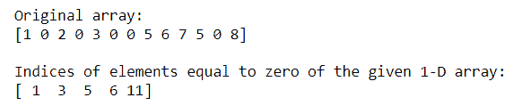

# 查找 NumPy 数组中等于零的元素的索引

> 原文:[https://www . geesforgeks . org/find-indexs-of-elements-等于零 in-a-numpy-array/](https://www.geeksforgeeks.org/find-indices-of-elements-equal-to-zero-in-a-numpy-array/)

有时我们需要找出数组中所有空元素的索引。Numpy 提供了许多函数来计算所有空元素的索引。

**方法 1:** 使用**[**numpy . where()**](https://www.geeksforgeeks.org/numpy-where-in-python/)查找空元素的索引**

**该函数返回满足给定条件的输入数组中元素的索引。**

****语法:****

```py
numpy.where(condition[, x, y])
When True, yield x, otherwise yield y 
```

## **蟒蛇 3**

```py
# importing Numpy package
import numpy as np

# creating a 1-D Numpy array
n_array = np.array([1, 0, 2, 0, 3, 0, 0, 5,
                    6, 7, 5, 0, 8])

print("Original array:")
print(n_array)

# finding indices of null elements using np.where()
print("\nIndices of elements equal to zero of the \
given 1-D array:")

res = np.where(n_array == 0)[0]
print(res)
```

****输出:****

****

****方法 2:** 使用 [**numpy.argwhere()**](https://www.geeksforgeeks.org/numpy-argwhere-in-python/) 查找空元素的索引**

**这个函数用于查找非零数组元素的索引，按元素分组。**

****语法**:**

```py
numpy.argwhere(arr) 
```

## **蟒蛇 3**

```py
# importing Numpy package
import numpy as np

# creating a 3-D Numpy array
n_array = np.array([[0, 2, 3],
                    [4, 1, 0],
                    [0, 0, 2]])

print("Original array:")
print(n_array)

# finding indices of null elements 
# using np.argwhere()
print("\nIndices of null elements:")
res = np.argwhere(n_array == 0)

print(res)
```