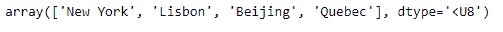
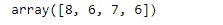

# 求 Numpy 数组中每个字符串元素的长度

> 原文:[https://www . geeksforgeeks . org/find-numpy 数组中每个字符串元素的长度/](https://www.geeksforgeeks.org/find-the-length-of-each-string-element-in-the-numpy-array/)

NumPy 建立在成功的数值数组对象之上(并且是其后继对象)。它的目标是为科学计算创造一个有用的环境。NumPy 提供了两个基本对象:一个 N 维数组对象(ndarray)和一个通用函数对象(ufunc)。

在这篇文章中，我们将讨论如何在给定的 numpy 数组中找到每个字符串元素的长度。

**问题#1 :** 给定一个 numpy 数组，其基础数据是字符串类型。找出给定对象中每个元素的长度。

**解决方案:**我们将使用`numpy.vectorize()`函数来查找给定 numpy 数组对象中每个元素的长度。

```
# importing the numpy library as np
import numpy as np

# Create a numpy array
arr = np.array(['New York', 'Lisbon', 'Beijing', 'Quebec'])

# Print the array
print(arr)
```

**输出:**



现在我们将使用`numpy.vectorize()`函数来查找给定 numpy 数组对象中每个元素的长度。

```
# Use vectorize function of numpy
length_checker = np.vectorize(len)

# Find the length of each element
arr_len = length_checker(arr)

# Print the length of each element
print(arr_len)
```

**输出:**



正如我们在输出中看到的，我们已经成功地计算了给定 numpy 数组对象中每个字符串元素的长度。

**问题#2 :** 给定一个 numpy 数组，其基础数据是字符串类型。找出给定对象中每个元素的长度。

**解决方案:**我们将使用 List 理解技术来找到给定 numpy 数组对象中每个元素的长度。

```
# importing the numpy library as np
import numpy as np

# Create a numpy array
arr = np.array(['New York', 'Lisbon', 'Beijing', 'Quebec'])

# Print the array
print(arr)
```

**输出:**


现在我们将使用列表理解技术来找到给定 numpy 数组对象中每个元素的长度。

```
# Find the length of each element
arr_len = [len(i) for i in arr]

# Print the length of each element
print(arr_len)
```

**输出:**


正如我们在输出中看到的，我们已经成功地计算了给定 numpy 数组对象中每个字符串元素的长度。