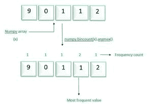

# 找到 NumPy 数组中最频繁的值

> 原文:[https://www . geeksforgeeks . org/find-numpy-array 中出现频率最高的值/](https://www.geeksforgeeks.org/find-the-most-frequent-value-in-a-numpy-array/)

在本文中，让我们讨论如何在 [NumPy](https://www.geeksforgeeks.org/python-numpy/) 数组中找到最频繁的值。

**寻找 NumPy 数组中最大频率值的步骤:**

*   创建一个 NumPy 数组。
*   应用 NumPy 的 bincount()方法获取数组中每个元素的出现次数。
*   n，应用 argmax()方法获取具有最大出现次数(频率)的值。



**例 1:**

## 蟒蛇 3

```py
import numpy as np

# create array
x = np.array([1,2,3,4,5,1,2,1,1,1])
print("Original array:")
print(x)

print("Most frequent value in the above array:")
print(np.bincount(x).argmax())
```

**输出:**

```py
1
```

该代码将只生成一个输出，如果数组包含多个具有最大频率数的元素，它将无法正常工作。

**示例 2:** 如果阵列中有多个元素具有最大频率

## 蟒蛇 3

```py
import numpy as np

x = np.array([1, 1, 1, 2, 3, 4, 2, 4, 3, 3, ])
print("Original array:")
print(x)

print("Most frequent value in above array")
y = np.bincount(x)
maximum = max(y)

for i in range(len(y)):
    if y[i] == maximum:
        print(i, end=" ")
```

**输出:**

```py
1 3
```