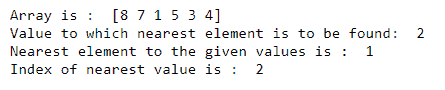
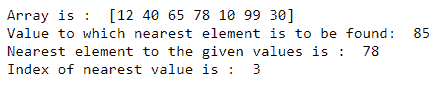

# 找到最近的数值和 NumPy 数组的索引

> 原文:[https://www . geeksforgeeks . org/find-最接近值和索引的 numpy-array/](https://www.geeksforgeeks.org/find-the-nearest-value-and-the-index-of-numpy-array/)

在本文中，让我们讨论用 NumPy 在数组中查找最近的值和索引。 [**Numpy**](https://www.geeksforgeeks.org/numpy-in-python-set-1-introduction/) 提供了一个高性能的多维数组对象，以及使用这些数组的工具。我们将利用 NumPy 库提供的许多函数中的两个来计算数组中最近的值和索引。这两个功能分别是 [**numpy.abs()**](https://www.geeksforgeeks.org/numpy-absolute-python/) 和[**numpy . arg min()**](https://www.geeksforgeeks.org/numpy-argmin-python/)**。**寻找数组中最近值和索引的方法如下:

**进场:**

*   取一个数组，比如说 arr[]和一个元素，比如说 x，我们必须找到最接近的值。
*   调用 numpy.abs(d)函数，其中 d 是数组元素和 x 之间的差，并将值存储在一个差数组中，比如 different _ array[]。
*   提供最小差异的元素将最接近指定值。
*   使用 numpy.argmin()，获取 difference_array[]中最小元素的索引。如果有多个最小值，将返回第一个值。
*   打印给定数组中最近的元素及其索引。

让我们看看下面基于上述方法的例子。

**例 1:**

## 蟒蛇 3

```
import numpy as np

# array
arr = np.array([8, 7, 1, 5, 3, 4])
print("Array is : ", arr)

# element to which nearest value is to be found
x = 2
print("Value to which nearest element is to be found: ", x)

# calculate the difference array
difference_array = np.absolute(arr-x)

# find the index of minimum element from the array
index = difference_array.argmin()
print("Nearest element to the given values is : ", arr[index])
print("Index of nearest value is : ", index)
```

**输出:**



在上面的例子中，我们获取了一个数组，我们需要从中找到与指定值最近的元素。指定的值是 2。我们从数组的每个元素中减去给定值，并将绝对值存储在不同的数组中。最小绝对差将对应于给定数字的最近值。在我们的例子中，(2-1)得到 1。因此，最小绝对差的索引是 2，索引 2 处原始数组的元素是 1。因此，1 最接近给定的数字，即 2。

**例 2:**

## 蟒蛇 3

```
import numpy as np

# array
arr = np.array([12, 40, 65, 78, 10, 99, 30])
print("Array is : ", arr)

# element to which nearest value is to be found
x = 85
print("Value to which nearest element is to be found: ", x)

# calculate the difference array
difference_array = np.absolute(arr-x)

# find the index of minimum element from the array
index = difference_array.argmin()
print("Nearest element to the given values is : ", arr[index])
print("Index of nearest value is : ", index)
```

**输出:**



在上面的例子中，我们获取了一个数组，我们需要从中找到与指定值最近的元素。指定的值是 85。我们从数组的每个元素中减去给定值，并将绝对值存储在不同的数组中。最小绝对差将对应于给定数字的最近值。在上面的例子中，(78-85)得到 7。因此，最小绝对差的索引是 3，索引 3 处原始数组的元素是 78。因此，78 最接近给定的数字，即 85。