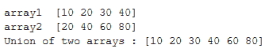
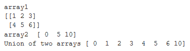
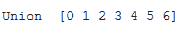

# 求两个 NumPy 数组的并集

> 原文:[https://www . geeksforgeeks . org/find-两个 numpy 数组的并集/](https://www.geeksforgeeks.org/find-the-union-of-two-numpy-arrays/)

为了找到两个一维数组的并集，我们可以使用 Python Numpy 库的函数 **[numpy.union1d()](https://www.geeksforgeeks.org/numpy-union1d-function-in-python/)** 。它返回唯一的排序数组，其值位于两个输入数组中的任何一个中。

**语法:**

```
numpy.union1d(array1, array2)

```

**注意**如果输入中给出的数组不是一维的，它们将被展平。

让我们看看如何找到两个数组的并集的例子。

**例 1:**

```
# import libraries
import numpy as np

arr1 = np.array([10, 20, 30, 40])
print("array1 ", arr1)

arr2 = np.array([20, 40, 60, 80])
print("array2 ", arr2)

# print union of the two arrays
print("Union of two arrays :", np.union1d(arr1, arr2))
```

**输出:**


**例 2:**
我们来看一个寻找二维和一维数组并集的例子。如前所述，如果作为参数传递给 numpy.union1d 函数的数组是二维的，那么它们将被展平为一维。

```
# import libraries
import numpy as np

# 2-d array
arr1 = np.array([[1, 2, 3], [4, 5, 6]])
print("array1 ")
print(arr1)

arr2 = np.array([0, 5, 10])
print("array2 ", arr2)

# print union of 2-d array and 1-d array
print("Union of two arrays", np.union1d(arr1, arr2))
```

**输出:**


**例 3:**
如果我们想找到两个以上数组的并集，那么我们可以通过使用 **functools.reduce** 函数来找到。

```
# code to find union of more than two arrays
# import libraries
import numpy as np
from functools import reduce

array = reduce(np.union1d, ([1, 2, 3], [1, 3, 5],
                            [2, 4, 6], [0, 0, 0]))
print("Union ", array)
```

**输出:**
