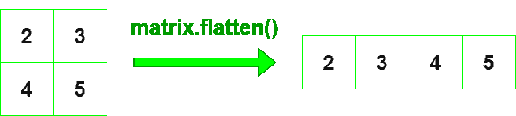

# 使用 NumPy

展平 Python 中的矩阵

> 原文:[https://www . geeksforgeeks . org/flat-a-matrix-in-python-using-numpy/](https://www.geeksforgeeks.org/flatten-a-matrix-in-python-using-numpy/)

让我们讨论如何使用 Python 中的 NumPy 来展平矩阵。通过使用[**ndarray . flat()**](https://www.geeksforgeeks.org/numpy-ndarray-flatten-function-python/)函数，我们可以在 python 中将矩阵展平到一维。

> **语法:** numpy_array .扁平化(顺序='C ')
> 
> *   **顺序:**“C”表示在行-主中展平。“f”表示在主列中变平。如果在内存中是 Fortran 连续的，则“a”表示按主要列顺序展平，否则按主要行顺序展平。“k”的意思是按照元素在内存中出现的顺序将 a 展平。默认值为“C”。
> 
> **返回:**展平一维矩阵



**例 1:**

## 蟒蛇 3

```py
# importing numpy as np
import numpy as np

# declare matrix with np
gfg = np.array([[2, 3], [4, 5]])

# using array.flatten() method
flat_gfg = gfg.flatten()
print(flat_gfg)
```

**输出:**

```py
[2 3 4 5]

```

**例 2:**

## 蟒蛇 3

```py
# importing numpy as np
import numpy as np

# declare matrix with np
gfg = np.array([[6, 9], [8, 5], [18, 21]])

# using array.flatten() method
gfg.flatten()
```

**输出:**

```py
array([ 6,  9,  8,  5, 18, 21])

```

**例 3:**

## 蟒蛇 3

```py
# importing numpy as np
import numpy as np

# declare matrix with np
gfg = np.array([[6, 9, 12], [8, 5, 2], [18, 21, 24]])

# using array.flatten() method
flat_gfg = gfg.flatten(order='A')
print(flat_gfg)
```

**输出:**

```py
[ 6,  9, 12,  8,  5,  2, 18, 21, 24]

```