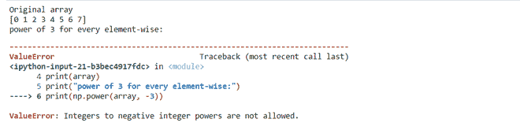

# 逐元素获取 NumPy 数组值的幂

> 原文:[https://www . geeksforgeeks . org/get-a-numpy-array-values-element-wise/](https://www.geeksforgeeks.org/get-the-powers-of-a-numpy-array-values-element-wise/)

NumPy 是一个强大的 N 维数组对象，它在线性代数、傅立叶变换和随机数功能中的使用。它提供的数组对象比传统的 Python 列表快得多。**[**numpy . power()**](https://www.geeksforgeeks.org/numpy-power-python/)**是用来计算元素的力量。它按元素处理从第二个数组提升到幂的第一个数组元素。****

> ******语法:** numpy.power(arr1，arr2，out = None，其中= True，casting = 'same_kind '，order = 'K '，dtype = None)****
> 
> ******参数:******
> 
>  ******arr 1:**【array _ like】作为基的输入数组或对象。
> **arr2 :** 【类数组】输入作为指数的数组或对象。
> **出:**【n 数组，可选】输出数组，与输入数组尺寸相同，
> 放置有结果。
> ****kwargs :** 允许您将关键字可变长度的参数传递给函数。
> 当我们想要处理函数中的命名参数时使用。
> **其中:**【array _ like，可选】True 值表示计算该位置的通用
> 函数(ufunc)，False 值表示将
> 值单独留在输出中。****

****那么，让我们来讨论一些与数组取幂相关的例子。****

******示例 1:** 计算具有不同元素方向值的数组的幂。****

## ****蟒蛇 3****

```
**# import required modules
import numpy as np

# creating the array
sample_array1 = np.arange(5)
sample_array2 = np.arange(0, 10, 2)

print("Original array ")
print("array1 ", sample_array1)
print("array2 ", sample_array2)

# calculating element-wise power
power_array = np.power(sample_array1, sample_array2)

print("power to the array1 and array 2 : ", power_array)**
```

******输出:******

```
**Original array 
array1  [0 1 2 3 4]
array2  [0 2 4 6 8]
power to the array1 and array 2 :  [    1     1    16   729 65536]**
```

******示例 2:** 对数组中的每个元素计算相同的幂。****

## ****蟒蛇 3****

```
**# import required module
import numpy as np

# creating the array
array = np.arange(8)
print("Original array")
print(array)

# computing the power of array
print("power of 3 for every element-wise:")
print(np.power(array, 3))**
```

******输出:******

```
**Original array
[0 1 2 3 4 5 6 7]
power of 3 for every element-wise:
[  0   1   8  27  64 125 216 343]**
```

******例 3:** 计算十进制值的幂。****

## ****蟒蛇 3****

```
**# import required modules
import numpy as np

# creating the array
sample_array1 = np.arange(5)

# initialization the decimal number
sample_array2 = [1.0, 2.0, 3.0, 3.0, 2.0]

print("Original array ")
print("array1 ", sample_array1)
print("array2 ", sample_array2)

# calculating element-wise power
power_array = np.power(sample_array1, sample_array2)

print("power to the array1 and array 2 : ", power_array)**
```

******输出:******

```
**Original array 
array1  [0 1 2 3 4]
array2  [1.0, 2.0, 3.0, 3.0, 2.0]
power to the array1 and array 2 :  [ 0\.  1\.  8\. 27\. 16.]**
```

******注意:**不能计算负幂****

******例 4:******

## ****蟒蛇 3****

```
**# importing module
import numpy as np

# creating the array
array = np.arange(8)
print("Original array")
print(array)
print("power of 3 for every element-wise:")

# computing the negative power element
print(np.power(array, -3))**
```

******输出:******

********