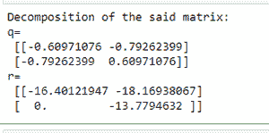
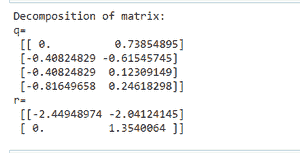
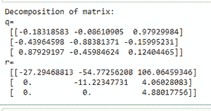

# 获取给定 NumPy 数组的 QR 分解

> 原文:[https://www . geeksforgeeks . org/get-the-QR-因式分解-给定-numpy-array/](https://www.geeksforgeeks.org/get-the-qr-factorization-of-a-given-numpy-array/)

在本文中，我们将讨论矩阵的 **QR 分解**或 **QR 分解**。矩阵的二维码分解是将一个矩阵分解成“A =二维码”，其中 Q 是正交的，R 是上三角矩阵。我们使用 ***函数分解矩阵。***

> **语法:** numpy.linalg.qr(a，mode='reduced ')
> 
> **参数:**
> 
> *   **a :** 需要分解的矩阵(M，N)。
> *   **模式:**可选。可以是:

以下是如何使用上述功能的一些示例:

**例 1:**2 x2 矩阵的 QR 分解

## 蟒蛇 3

```
# Import numpy package
import numpy as np

# Create a numpy array 
arr = np.array([[10,22],[13,6]])

# Find the QR factor of array
q, r =  np.linalg.qr(arr)

# Print the result
print("Decomposition of matrix:")
print( "q=\n", q, "\nr=\n", r)
```

**输出:**



**例 2:**2X4 矩阵的 QR 分解

## 蟒蛇 3

```
# Import numpy package
import numpy as np

# Create a numpy array 
arr = np.array([[0, 1], [1, 0], [1, 1], [2, 2]])

# Find the QR factor of array
q, r =  np.linalg.qr(arr)

# Print the result
print("Decomposition of matrix:")
print( "q=\n", q, "\nr=\n", r)
```

**输出:**



**例 3:**3x 3 矩阵的 QR 分解

## 蟒蛇 3

```
# Import numpy package
import numpy as np

# Create a numpy array 
arr = np.array([[5, 11, -15], [12, 34, -51],
                [-24, -43, 92]], dtype=np.int32)

# Find the QR factor of array
q, r = np.linalg.qr(arr)

# Print the result
print("Decomposition of matrix:")
print( "q=\n", q, "\nr=\n", r)
```

**输出:**

