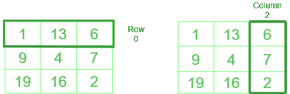

# 如何按列访问 NumPy 数组

> 原文:[https://www . geesforgeks . org/如何按列访问一个 numpy 数组/](https://www.geeksforgeeks.org/how-to-access-a-numpy-array-by-column/)

通过特定的列索引访问基于 [**NumPy**](https://www.geeksforgeeks.org/python-numpy/) 的数组可以通过 [**索引**](https://www.geeksforgeeks.org/numpy-indexing/) 来实现。让我们详细讨论一下。

NumPy 遵循标准的基于 0 的索引。



NumPy 中的行和列类似于 Python 列表

**示例:**

```py
Given array : 1 13 6
              9  4 7
              19 16 2

Input: print(NumPy_array_name[ :,2])

# printing *2nd* column
Output: [6 7 2]

Input: x = NumPy_array_name[ :,1]
       print(x)

# storing 1st column into variable x
Output:  [13 4 16]
```

**方法#1:使用切片选择**

> **语法:**
> 
> **为列:** numpy_Array_name[:， ***列***
> 
> ****为排:**numpy _ Array _ name【*T3】排，T5:】***

## **蟒蛇 3**

```py
# Python code to select row and column
# in NumPy

import numpy as np

array = [[1, 13, 6], [9, 4, 7], [19, 16, 2]]

# defining array
arr = np.array(array)

print('printing array as it is')
print(arr)

print('printing 0th row')
print(arr[0, :])

print('printing 2nd column')
print(arr[:, 2])

# multiple columns or rows can be selected as well
print('selecting 0th and 1st row simultaneously')
print(arr[:,[0,1]])
```

****输出:****

```py
printing array as it is
[[ 1 13  6]
 [ 9  4  7]
 [19 16  2]]
printing 0th row
[ 1 13  6]
printing 2nd column
[6 7 2]
selecting 0th and 1st row simultaneously
[[ 1 13]
 [ 9  4]
 [19 16]]
```

****方法 2:使用省略号****

> ****语法:****
> 
> ****列**:numpy _ Array _ name【**……**，列】**
> 
> ****第**行:numpy_Array_name【第 **…** 行】**
> 
> **其中“ **…** ”表示给定行或列中没有元素**

****注意:**这不是一个非常*实用的*方法，但是你必须尽可能了解。**

## **蟒蛇 3**

```py
# program to select row and column
# in numpy using ellipsis

import numpy as np

# defining array
array = [[1, 13, 6], [9, 4, 7], [19, 16, 2]]

# converting to numpy array
arr = np.array(array)

print('printing array as it is')
print(arr)

print('selecting 0th column')
print(arr[..., 0])

print('selecting 1st row')
print(arr[1, ...])
```

****输出:****

```py
printing array as it is
[[ 1 13  6]
 [ 9  4  7]
 [19 16  2]]
selecting 0th column
[ 1  9 19]
selecting 1st row
[9 4 7]
```