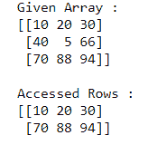
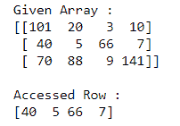
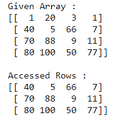
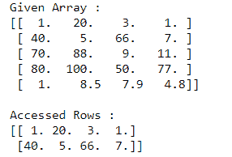
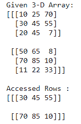
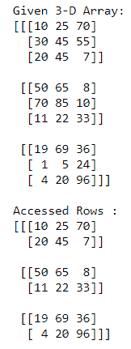

# 如何访问多维 NumPy 数组的不同行？

> 原文:[https://www . geesforgeks . org/如何访问多维 numpy 数组的不同行/](https://www.geeksforgeeks.org/how-to-access-different-rows-of-a-multidimensional-numpy-array/)

让我们看看如何在 NumPy 中访问多维数组的不同行。有时我们需要访问多维 NumPy 数组的不同行，比如第一行、最后两行，甚至中间两行等等。在 NumPy 中，访问多维数组的任何行都非常容易。我们需要做的就是**根据给定的条件对**数组进行切片。每当我们需要执行分析时，切片就起着重要的作用。

**情况 1:在二维阵列中**

**示例 1:** 访问二维 NumPy 数组的第一行和最后一行

## 蟒蛇 3

```py
# Importing Numpy module
import numpy as np

# Creating a 3X3 2-D Numpy array
arr = np.array([[10, 20, 30], 
                [40, 5, 66], 
                [70, 88, 94]])

print("Given Array :")
print(arr)

# Access the First and Last rows of array
res_arr = arr[[0,2]]
print("\nAccessed Rows :")
print(res_arr)
```

**输出:**



在上面的例子中，我们访问并打印了 3X3 NumPy 数组的第一行和最后一行。

**示例 2:** 访问二维 NumPy 数组的中间行

## 蟒蛇 3

```py
# Importing Numpy module
import numpy as np

# Creating a 3X4 2-D Numpy array
arr = np.array([[101, 20, 3, 10], 
                [40, 5, 66, 7], 
                [70, 88, 9, 141]])

print("Given Array :")
print(arr)

# Access the Middle row of array
res_arr = arr[1]
print("\nAccessed Row :")
print(res_arr)
```

**输出:**



在上面的例子中，我们访问并打印了 3X4 NumPy 数组的中间行。

**示例 3:** 访问二维数组的最后三行

## 蟒蛇 3

```py
# Importing Numpy module
import numpy as np

# Creating a 4X4 2-D Numpy array
arr = np.array([[1, 20, 3, 1], 
                [40, 5, 66, 7], 
                [70, 88, 9, 11],
               [80, 100, 50, 77]])

print("Given Array :")
print(arr)

# Access the Last three rows of array
res_arr = arr[[1,2,3]]
print("\nAccessed Rows :")
print(res_arr)
```

**输出:**



在上面的例子中，我们访问并打印了 4X4 NumPy 数组的最后三行。

**示例 4:** 访问二维 NumPy 数组的前两行

## 蟒蛇 3

```py
# Importing Numpy module
import numpy as np

# Creating a 5X4 2-D Numpy array
arr = np.array([[1, 20, 3, 1], 
                [40, 5, 66, 7], 
                [70, 88, 9, 11],
               [80, 100, 50, 77],
               [1, 8.5, 7.9, 4.8]])

print("Given Array :")
print(arr)

# Access the First two rows of array
res_arr = arr[[0,1]]
print("\nAccessed Rows :")
print(res_arr)
```

**输出:**



在上面的示例中，我们访问并打印了 5X4 NumPy 数组的前两行。

**情况 2:在三维阵列中**

**示例 1:** 访问三维 NumPy 阵列的中间行

## 蟒蛇 3

```py
# Importing Numpy module 
import numpy as np

# Creating 3-D Numpy array
n_arr = np.array([[[10, 25, 70], [30, 45, 55], [20, 45, 7]], 
                  [[50, 65, 8], [70, 85, 10], [11, 22, 33]]])

print("Given 3-D Array:")
print(n_arr)

# Access the Middle rows of 3-D array
res_arr = n_arr[:,[1]]
print("\nAccessed Rows :")
print(res_arr)
```

**输出:**



在上面的例子中，我们访问并打印了三维 NumPy 数组的中间行。

**示例 2:** 访问三维 NumPy 数组的第一行和最后一行

## 蟒蛇 3

```py
# Importing Numpy module 
import numpy as np

# Creating 3-D Numpy array
n_arr = np.array([[[10, 25, 70], [30, 45, 55], [20, 45, 7]], 
                  [[50, 65, 8], [70, 85, 10], [11, 22, 33]],
                 [[19, 69, 36], [1, 5, 24], [4, 20, 96]]])

print("Given 3-D Array:")
print(n_arr)

# Access the First and Last rows of 3-D array
res_arr = n_arr[:,[0, 2]]
print("\nAccessed Rows :")
print(res_arr)
```

**输出:**



在上面的例子中，我们访问并打印了三维 NumPy 数组的第一行和最后一行。