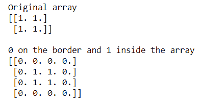
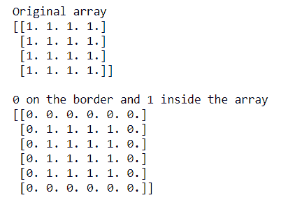

# 如何在 NumPy 数组周围添加边框？

> 原文:[https://www . geeksforgeeks . org/如何在 numpy 数组周围添加边框/](https://www.geeksforgeeks.org/how-to-add-a-border-around-a-numpy-array/)

有时我们需要在 NumPy 矩阵周围添加边框。Numpy 提供了一个名为 **'numpy.pad()'** 的函数来构造边框。下面的例子展示了如何在**身份矩阵周围构建**“0”的边界。****

**语法:**

```
numpy.pad(array, pad_width, mode='constant', **kwargs)  

```

**示例 1:** 围绕 **2D 身份**矩阵构建 **0s** 的边界

## 蟒蛇 3

```
# importing Numpy package
import numpy as np

# Creating a 2X2 Numpy matrix
array = np.ones((2, 2))

print("Original array")
print(array)

print("\n0 on the border and 1 inside the array")

# constructing border of 0 around 2D identity matrix
# using np.pad()
array = np.pad(array, pad_width=1, mode='constant',
               constant_values=0)

print(array)
```

**输出:**



在上面的例子中，我们在二维 NumPy 矩阵周围构造了一个 0 的边界。

**示例 2:** 围绕**三维身份**矩阵构建 **0s** 的边界

## 蟒蛇 3

```
# importing Numpy package
import numpy as np

# Creating a 3X3 Numpy matrix
array = np.ones((3, 3))

print("Original array")
print(array)

print("\n0 on the border and 1 inside the array")

# constructing border of 0 around 3D identity matrix
# using np.pad()
array = np.pad(array, pad_width=1, mode='constant',
               constant_values=0)

print(array)
```

**输出:**


在上面的例子中，我们在三维 NumPy 矩阵周围构造了一个 0 的边界。

**示例 3:** 围绕 **4D 身份**矩阵构建 **0s** 的边界

## 蟒蛇 3

```
# importing Numpy package
import numpy as np

# Creating a 4X4 Numpy matrix
array = np.ones((4, 4))

print("Original array")
print(array)

print("\n0 on the border and 1 inside the array")

# constructing border of 0 around 4D identity matrix
# using np.pad()
array = np.pad(array, pad_width=1, mode='constant',
               constant_values=0)

print(array)
```

**输出:**



在上面的例子中，我们在四维 NumPy 矩阵周围构造了一个 0 的边界。