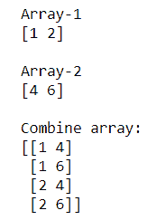
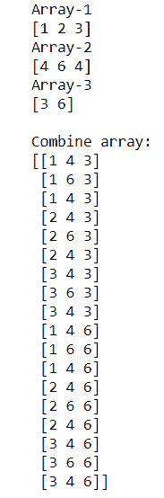
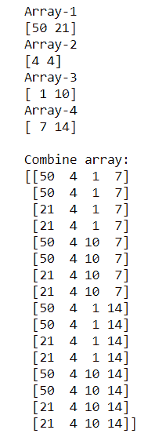

# 如何构建两个 NumPy 数组的所有组合的数组？

> 原文:[https://www . geeksforgeeks . org/如何构建两个 numpy 数组的所有组合的数组/](https://www.geeksforgeeks.org/how-to-build-an-array-of-all-combinations-of-two-numpy-arrays/)

有时我们需要找到两个或多个数组元素的组合。Numpy 具有计算 2 个或更多 Numpy 阵列的组合的功能，命名为“[**【Numpy . mesh grid()**](https://www.geeksforgeeks.org/numpy-meshgrid-function/)”。该函数用于从两个给定的一维数组中创建一个矩形网格，表示笛卡尔索引或矩阵索引。

**语法:**

```
numpy.meshgrid(*xi, copy=True, sparse=False, indexing='xy')

```

**示例 1:** 计算两个 NumPy 阵列的**元素的组合**

## 蟒蛇 3

```
# importing Numpy package
import numpy as np

# creating 2 numpy arrays
array_1 = np.array([1, 2])
array_2 = np.array([4, 6])

print("Array-1")
print(array_1)

print("\nArray-2")
print(array_2)

# combination of elements of array_1 and array_2
# using numpy.meshgrid().T.reshape()
comb_array = np.array(np.meshgrid(array_1, array_2)).T.reshape(-1, 2)

print("\nCombine array:")
print(comb_array)
```

**输出:**



在上面的示例中，我们使用**numpy . mesh grid(). t . resform()**组合了“ **array_1** ”和“ **array_2** 的元素

**示例 2:** 计算**三个** NumPy 数组的元素组合

## 蟒蛇 3

```
# importing Numpy package
import numpy as np

# creating 3 numpy arrays
array_1 = np.array([1, 2, 3])
array_2 = np.array([4, 6, 4])
array_3 = np.array([3, 6])

print("Array-1")
print(array_1)

print("Array-2")
print(array_2)

print("Array-3")
print(array_3)

# combination of elements of array_1,
# array_2 and array_3 using 
# numpy.meshgrid().T.reshape()
comb_array = np.array(
  np.meshgrid(array_1, array_2, array_3)).T.reshape(-1, 3)

print("\nCombine array:")
print(comb_array)
```

**输出:**



在上面的例子中，我们使用 numpy.meshgrid()组合了“ **array_1** ”、“ **array_2** 和“ **array_3** 的元素

**示例 3:** 计算**四个** NumPy 数组的元素组合

## 蟒蛇 3

```
# importing Numpy package
import numpy as np

# creating 4 numpy arrays
array_1 = np.array([50, 21])
array_2 = np.array([4, 4])
array_3 = np.array([1, 10])
array_4 = np.array([7, 14])

print("Array-1")
print(array_1)

print("Array-2")
print(array_2)

print("Array-3")
print(array_3)

print("Array-4")
print(array_4)

# combination of elements of array_1, 
# array_2, array_3 and array_4
# using numpy.meshgrid().T.reshape()
comb_array = np.array(np.meshgrid(
    array_1, array_2, array_3, array_4)).T.reshape(-1, 4)

print("\nCombine array:")
print(comb_array)
```

**输出:**



在上面的示例中，我们使用 numpy.meshgrid()组合了“ **array_1** ”、“ **array_2** ”、“ **array_3** ”和“ **array_4** 的元素