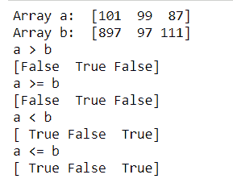

# 如何比较两个 NumPy 数组？

> 原文:[https://www . geeksforgeeks . org/如何比较两个 numpy 数组/](https://www.geeksforgeeks.org/how-to-compare-two-numpy-arrays/)

本文重点介绍在数组上使用 NumPy 进行的比较。比较两个 NumPy 数组通过检查每个对应索引处的每个元素是否相同来确定它们是否等价。

**方法 1:**

我们一般使用`==`运算符比较两个 NumPy 数组，生成一个新的数组对象。如果两个 NumPy 数组相等，则使用新数组对象作为 ndarray 调用 ndarray.all()以返回 True。

```py
import numpy as np

an_array = np.array([[1, 2], [3, 4]])
another_array = np.array([[1, 2], [3, 4]])

comparison = an_array == another_array
equal_arrays = comparison.all()

print(equal_arrays)
```

**输出:**

```py
True
```

**方法二:**

我们还可以使用大于、小于和等于运算符进行比较。要理解，请看下面的代码。

```py
Syntax : numpy.greater(x1, x2[, out])
Syntax : numpy.greater_equal(x1, x2[, out])
Syntax : numpy.less(x1, x2[, out])
Syntax : numpy.less_equal(x1, x2[, out])
```

```py
import numpy as np

a = np.array([101, 99, 87])
b = np.array([897, 97, 111])

print("Array a: ", a)
print("Array b: ", b)

print("a > b")
print(np.greater(a, b))

print("a >= b")
print(np.greater_equal(a, b))

print("a < b")
print(np.less(a, b))

print("a <= b")
print(np.less_equal(a, b))
```

**输出:**
