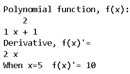
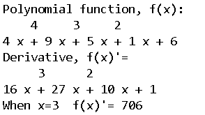
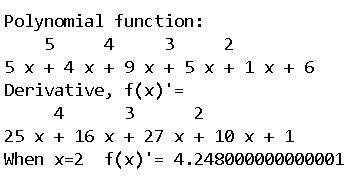
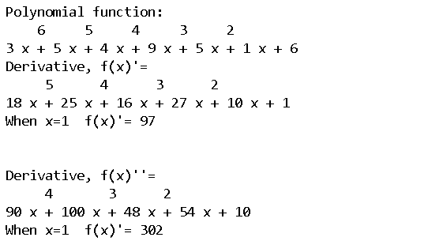

# 如何用 Numpy 计算导数？

> 原文:[https://www . geeksforgeeks . org/如何使用-numpy/](https://www.geeksforgeeks.org/how-to-compute-derivative-using-numpy/) 计算导数

在本文中，我们将学习如何使用 [NumPy](https://www.geeksforgeeks.org/numpy-in-python-set-1-introduction/) 计算导数。通常，NumPy 不提供任何稳健的函数来计算不同多项式的导数。然而，NumPy 可以使用函数 [numpy.poly1d()](https://www.geeksforgeeks.org/numpy-poly1d-in-python/) 和 deriv()计算一维多项式的特殊情况。

### **使用的功能:**

*   **poly1d():** 有助于定义多项式表达式或函数。
*   **deriv():** 计算并给出导数表达式

### **进场:**

*   首先，我们需要使用 *numpy.poly1d()* 函数定义一个多项式函数。
*   然后我们需要使用*deriver()*函数推导出导数表达式。
*   最后，我们可以给 x 一个所需的值来数值计算导数。

下面是一些例子，我们使用 NumPy 计算一些表达式的导数。这里我们取变量“var”中的表达式，并将其与“x”进行区分。

**例 1:**

## 蟒蛇 3

```
import numpy as np

# defining polynomial function
var = np.poly1d([1, 0, 1])
print("Polynomial function, f(x):\n", var)

# calculating the derivative
derivative = var.deriv()
print("Derivative, f(x)'=", derivative)

# calculates the derivative of after 
# given value of x
print("When x=5  f(x)'=", derivative(5))
```

**输出:**



**例 2:**

## 蟒蛇 3

```
import numpy as np

# defining polynomial function
var = np.poly1d([4, 9, 5, 1, 6])
print("Polynomial function, f(x):\n", var)

# calculating the derivative
derivative = var.deriv()
print("Derivative, f(x)'=\n", derivative)

# calculates the derivative of after 
# given value of x
print("When x=3  f(x)'=", derivative(3))
```

**输出:**



**例 3:**

## 蟒蛇 3

```
import numpy as np

# defining polynomial function
var = np.poly1d([5, 4, 9, 5, 1, 6])
print("Polynomial function:\n", var)

# calculating the derivative
derivative = var.deriv()
print("Derivative, f(x)'=\n", derivative)

# calculates the derivative of after 
# given value of x
print("When x=2  f(x)'=", derivative(0.2))
```

**输出:**



为了计算双导数，我们可以简单地使用 deriv()函数两次。

**例 4:**

## 蟒蛇 3

```
import numpy as np

# defining polynomial function
var = np.poly1d([3, 5, 4, 9, 5, 1, 6])
print("Polynomial function:\n", var)

# calculating the derivative
derivative = var.deriv()
print("Derivative, f(x)'=\n", derivative)

# calculates the derivative of after 
# given value of x
print("When x=1  f(x)'=", derivative(1))
derivative1 = derivative.deriv()

print("\n\nDerivative, f(x)''=\n", derivative1)
print("When x=1  f(x)'=", derivative1(1))
```

**输出:**

