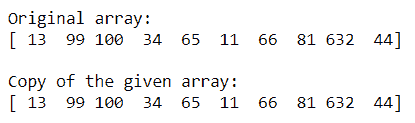
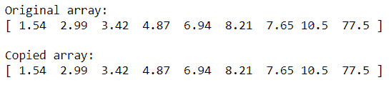
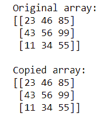
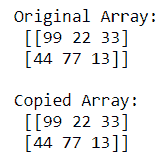

# 如何将 NumPy 数组复制到另一个数组中？

> 原文:[https://www . geeksforgeeks . org/如何将 numpy-array 复制到另一个阵列/](https://www.geeksforgeeks.org/how-to-copy-numpy-array-into-another-array/)

很多时候需要将一个阵列复制到另一个阵列。Numpy 提供了使用不同方法复制数组的工具。有 3 种方法可以将一个 Numpy 数组复制到另一个数组。

**方法 1:** 使用[NP . empty _ like()](https://www.geeksforgeeks.org/numpy-empty_like-python/)**T5】功能**

该函数返回一个与给定数组具有相同形状和类型的新数组。

**语法:**

```py
numpy.empty_like(a, dtype = None, order = ‘K’, subok = True)

```

## 蟒蛇 3

```py
# importing Numpy package
import numpy as np

# Creating a numpy array using np.array()
ary = np.array([13, 99, 100, 34, 65, 11, 
                66, 81, 632, 44])

print("Original array: ")

# printing the Numpy array
print(ary)

# Creating an empty Numpy array similar
# to ary
copy = np.empty_like(ary)

# Now assign ary to copy
copy[:] = ary

print("\nCopy of the given array: ")

# printing the copied array
print(copy)
```

**输出:**



在上面的示例中，使用 np.empty_like()函数将给定的 Numpy 数组“ **ary** ”复制到另一个数组“ **copy**

**方法 2:** 使用 np.copy()函数

该函数  返回给定对象的数组副本。

**语法:**

```py
numpy.copy(a, order='K', subok=False)
```

**例 1:**

## 蟒蛇 3

```py
# importing Numpy package
import numpy as np

# Creating a numpy array using np.array()
org_array = np.array([1.54, 2.99, 3.42, 4.87, 6.94,
                      8.21, 7.65, 10.50, 77.5])

print("Original array: ")

# printing the Numpy array
print(org_array)

# Now copying the org_array to copy_array
# using np.copy() function
copy_array = np.copy(org_array)

print("\nCopied array: ")

# printing the copied Numpy array
print(copy_array)
```

**输出:**



在上例中，使用 np.copy()函数将给定的 Numpy 数组“ **org_array** ”复制到另一个数组“ **copy_array** ”

**示例 2:** 使用 **np.copy()** 功能将给定的**三维**阵列复制到另一个阵列

## 蟒蛇 3

```py
# importing Numpy package
import numpy as np

# Creating a 3-D numpy array using np.array()
org_array = np.array([[23, 46, 85],
                      [43, 56, 99],
                      [11, 34, 55]])

print("Original array: ")

# printing the Numpy array
print(org_array)

# Now copying the org_array to copy_array
# using np.copy() function
copy_array = np.copy(org_array)

print("\nCopied array: ")

# printing the copied Numpy array
print(copy_array)
```

**输出:**



在上面的示例中，使用 np.copy()函数将给定的三维 Numpy 数组“ **org_array** ”复制到另一个数组“ **copy_array** ”

**方法 3:** 使用**赋值**运算符

## 蟒蛇 3

```py
# importing Numpy package
import numpy as np

# Create a 2-D Numpy array using np.array()
org_array = np.array([[99, 22, 33],
                      [44, 77, 66]])

# Copying org_array to copy_array
# using Assignment operator
copy_array = org_array

# modifying org_array
org_array[1, 2] = 13

# checking if copy_array has remained the same

# printing original array
print('Original Array: \n', org_array)

# printing copied array
print('\nCopied Array: \n', copy_array)
```

**输出:**



在上面的例子中，给定的 Numpy 数组“ **org_array** ”使用赋值运算符被复制到另一个数组“ **copy_array** ”。