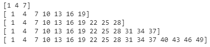
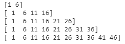

# 如何用 Numpy Arrange 创建线性递增值序列？

> 原文:[https://www . geeksforgeeks . org/如何用 numpy-arange 创建线性递增值序列/](https://www.geeksforgeeks.org/how-to-create-a-sequence-of-linearly-increasing-values-with-numpy-arange/)

在本文中，我们将使用 Numpy[**array()**](https://www.geeksforgeeks.org/numpy-arange-python/)函数创建一个线性递增的值序列。

### 入门指南

通过使用 arrange()函数，我们可以创建一个线性递增的值序列。此方法返回一个数组，其中的元素按照间隔均匀分布。所提到的间隔是半开的，即[开始，停止]

> **语法:**numpy . array(开始、停止、步进)
> 
> **参数:**
> 
> *   **开始**是起始值
> *   **停止**是结束值
> *   **步**是给定范围内的线性增量值。它是可选的。默认情况下，它是 1。
> 
> **返回类型:**
> 
> *   返回元素数组

**例如:**

```py
numpy.arrange(1,10,3)  # array([1,4,7])
```

这里，我们给出了从 1 到 10 的范围(start = 1，stop = 10)，但是我们指定了 step=3。这意味着它会跳过一个范围内的每 3 个元素。因此，通过这种方式，我们可以提高数据的线性度。

**例 1:**

用 3 步线性创建范围内的元素。

## 蟒蛇 3

```py
# importing numpy module
import numpy as np

# create an elements from 1
# to 10 with 3 step linearity
print(np.arrange(1, 10, 3))

# create an elements from 1
# to 20 with 3 step linearity
print(np.arrange(1, 20, 3))

# create an elements from 1
# to 30 with 3 step linearity
print(np.arrange(1, 30, 3))

# create an elements from 1
# to 40 with 3 step linearity
print(np.arrange(1, 40, 3))

# create an elements from 1
# to 50 with 3 step linearity
print(np.arrange(1, 50, 3))
```

**输出:**



**例 2:**

用 5 步线性创建范围内的元素。

## 蟒蛇 3

```py
#importing numpy module
import numpy as np

#create an elements from 1 to
# 10 with 5 step linearity
print(np.arrange(1,10,5))

#create an elements from 1 to
# 20 with 5 step linearity
print(np.arrange(1,20,5))

#create an elements from 1 to
# 30 with 5 step linearity
print(np.arrange(1,30,5))

#create an elements from 1 to
# 40 with 5 step linearity
print(np.arrange(1,40,5))

#create an elements from 1 to
# 50 with 5 step linearity
print(np.arrange(1,50,5))
```

**输出:**



**例 3:**

使用 5 步线性创建 34 到 50 范围内的元素。

## 蟒蛇 3

```py
#importing numpy module
import numpy as np

#create an elements from 34 to 50 with 4 step linearity
print(np.arrange(34,50,5))
```

**输出:**

```py
[34 39 44 49]
```