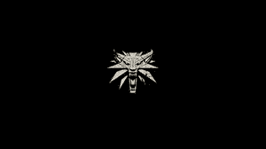

# 如何使用 Numpy 模块裁剪图像？

> 原文:[https://www . geeksforgeeks . org/如何使用 numpy 模块裁剪图像/](https://www.geeksforgeeks.org/how-to-crop-an-image-using-the-numpy-module/)

在本文中，我们将了解在不使用任何附加模块的情况下裁剪图像的最简单有效的方法。

*numpy* 模块是一个 Python 库，用于处理数组和大型数据集。Python 对数组没有任何本机支持，这与 C、C++、Java 等其他高级语言相反。它为数组提供了一个本地实现。Python 有链表，这确实解决了静态分配的问题(大部分)，并且允许存储异构数据，但是不允许数据的连续存储。 *Numpy* 通过在语言中引入数组来弥补这一缺陷，数组是一种同构数据结构，存储在连续的内存位置。

由于图像内部的数据(不包括标题信息)是同类的，并且通常是按顺序或通过直接访问(通过添加偏移量)来访问的，因此使用阵列来存储图像像素数据允许对图像进行更快的操作。在本文中，我们将看一下使用 *Numpy* 数组(包含像素信息)裁剪图像。

在许多模块中有各种方法来裁剪图像，裁剪图像最简单有效的方法是使用 *numpy* 数组的索引。

## **对裁剪图像使用索引**

由于 *Numpy* 本身不支持图像裁剪方法(因为它不是图像处理库)，我们可以使用索引方法来实现我们的目的。为了演示，我们将使用以下图像:-



下图为 4K (3840×2160)尺寸。

我们将裁剪上面的图像，这样中间的标志占据了图像的很大一部分。

由于裁剪图像是**通常*手动操作，我们必须事先获得感兴趣区域的坐标。裁剪需要 4 个坐标(或一对大小为 2 的元组)。第一组坐标指定了感兴趣区域(或 Bbox)的左上角，接下来的两组坐标表示感兴趣区域的右下角坐标。在我们的案例中，感兴趣区域的坐标是 *(1413，653)* 和 *(2361，1385)* (假设使用了行主索引)。为了显示和读取图像，我们将借助于*枕头*库，这是 python 中的图像处理库。

**下面是裁剪给定图像的程序:**

## 蟒蛇 3

```py
# Import required modules
from PIL import Image
import numpy as np

# Load image
image = Image.open('W3.jpg')

# Convert image to array
image_arr = numpy.array(image)

# Crop image
image_arr = image_arr[700:1400, 1450:2361]

# Convert array to image
image = Image.fromarray(image_arr)

# Display image
image.show()
```

**输出:**


**说明:**

*   首先我们导入了 *PIL* (或抱枕)库的 Image 模块。然后我们导入了别名为 *np* (通用惯例)的 *Numpy* 库。之后我们创建了我们想要的图像的图像对象(*W3.jpg*，并将该对象存储在变量*图像*中。因此，图像变量的类型是*pil . jpegimageplugin . jpegimagefile .*
*   为了从这个对象中创建 *Numpy* 数组，我们通过 *np.array* ()方法传递它，该方法从图像中提取所有像素数据并将其存储在变量 *image_arr* 中。这导致我们有一个形状为 *(2160，3840，3)* 的 *Numpy* 数组。
*   然后我们从每个维度切割数组。在语句 *image_arr[700:1400，1450:2361]* 中， *700* 表示起始行， *1400* 表示结束行。其中， *1450* 代表起始列， *2316* 代表结束列。所有这些值都描绘了该位置的像素，因此裁剪的左上角坐标为 *(1450，700)* ，左下角坐标为 *(2361，1400)* 。
*   最后，我们使用 *Image.fromarray()* 将 *Numpy* 数组转换回图像。最后，我们使用 *show()* 功能显示图像。