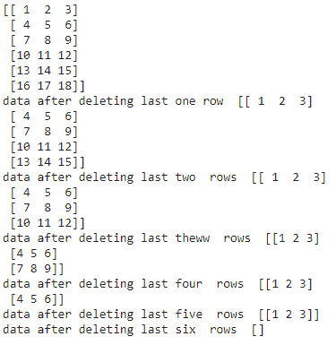
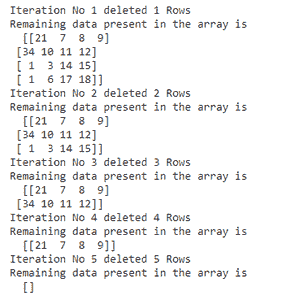

# 如何从 Numpy 数组中删除最后 N 行？

> 原文:[https://www . geeksforgeeks . org/如何从 numpy 数组中删除最后 n 行/](https://www.geeksforgeeks.org/how-to-delete-last-n-rows-from-numpy-array/)

在本文中，我们将讨论如何从 NumPy 数组中删除最后 N 行。

### **方法一:使用切片算子**

**切片**是一种索引操作，用于迭代数组。

> **语法:** array_name[start:stop]
> 
> 其中开始是开始是索引，停止是最后一个索引。

我们也可以用 Python 做负切片。它由下面的语法表示。

> **语法:** array_name[: -n]
> 
> 其中，n 是从最后删除的行数。

**示例 1:**

我们将创建一个 6 行 3 列的数组，并使用切片删除最后 N 行。

## 蟒蛇 3

```py
# importing numpy module
import numpy as np

# create an array with 6 rows and 3 columns
a = np.array([[1, 2, 3], [4, 5, 6], [7, 8, 9], 
              [10, 11, 12], [13, 14, 15], [16, 17, 18]])

print(a)

# delete last 1 st row
print("data after deleting last one row ", a[:-1])

# delete last 2 nd  row
print("data after deleting last two  rows ", a[:-2])

# delete last 3 rd  row
print("data after deleting last theww  rows ", a[:-3])

# delete last 4 th  row
print("data after deleting last four  rows ", a[:-4])

# delete last 5 th  row
print("data after deleting last five  rows ", a[:-5])

# delete last 6 th  row
print("data after deleting last six  rows ", a[:-6])
```

**输出:**



**例 2:**

我们使用 for 循环迭代元素，并使用 slice 运算符，我们将删除数据，然后打印数据。

## 蟒蛇 3

```py
# importing numpy module
import numpy as np

# create an array with 5 rows and 
# 4 columns
a = np.array([[21, 7, 8, 9], [34, 10, 11, 12], 
              [1, 3, 14, 15], [1, 6, 17, 18], 
              [4, 5, 6, 7]])

# use for loop to iterate over the
# elements
for i in range(1, len(a)+1):
    print("Iteration No", i, "deleted", i, "Rows")
    print("Remaining data present in the array is\n ", a[:-i])
```

**输出:**



**例 3:**

我们还可以指定我们需要的元素，并使用 slice 运算符将它们存储到另一个数组变量中。这样，我们就不会得到最后 N 行(删除那些行)。

## 蟒蛇 3

```py
# importing numpy module
import numpy as np

# create an array with 5 rows and 
# 4 columns
a = np.array([[21, 7, 8, 9], [34, 10, 11, 12], 
              [1, 3, 14, 15], [1, 6, 17, 18],
              [4, 5, 6, 7]])

# place first 2 rows in b variable 
# using slice operator
b = a[:2]

print(b)
```

**输出:**

```py
[[21  7  8  9]
 [34 10 11 12]]
```

### **方法二:使用**[**numpy . delete()**](https://www.geeksforgeeks.org/numpy-delete-python/)**方法**

它用于根据行号删除 NumPy 数组中的元素。

> **语法:** numpy.delete(array_name，[rownumber1，rownumber2，.，行号 n]，轴)
> 
> **参数:**
> 
> *   array_name 是数组的名称。
> *   行号是行值
> *   轴指定的行或列
>     *   axis=0 指定行
>     *   axis=1 指定列

这里我们要删除最后几行，所以在列表中指定行号。

**例 1:** **删除最后三行**

## 蟒蛇 3

```py
# importing numpy module
import numpy as np

# create an array with 5 rows and 
# 4 columns
a = np.array([[21, 7, 8, 9], [34, 10, 11, 12], 
              [1, 3, 14, 15], [1, 6, 17, 18], 
              [4, 5, 6, 7]])

# delete last three rows
# using numpy.delete
a = np.delete(a, [2, 3, 4], 0)
print(a)
```

**输出:**

```py
[[21  7  8  9]
 [34 10 11 12]]
```

**例 2:删除所有行**

## 蟒蛇 3

```py
# importing numpy module
import numpy as np

# create an array with 5 rows and 4 columns
a = np.array([[21, 7, 8, 9], [34, 10, 11, 12], 
              [1, 3, 14, 15], [1, 6, 17, 18], 
              [4, 5, 6, 7]])

# delete last three rows
# using numpy.delete
a = np.delete(a, [0, 1, 2, 3, 4], 0)
print(a)
```

**输出:**

```py
[ ]
```