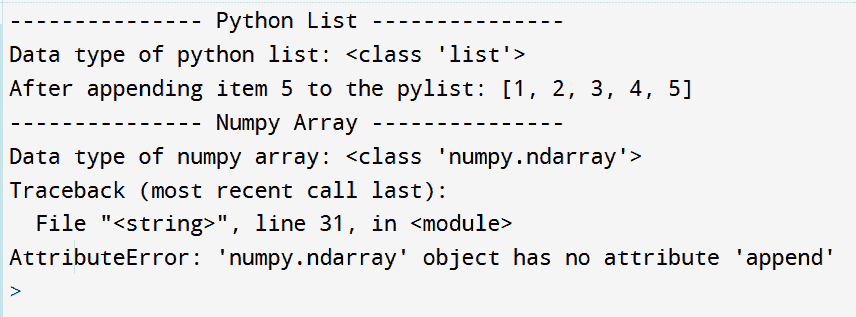

# 如何修复:“numpy.ndarray”对象没有属性“append”

> 原文:[https://www . geesforgeks . org/how-fix-numpy-ndarray-object-has-no-attribute-append/](https://www.geeksforgeeks.org/how-to-fix-numpy-ndarray-object-has-no-attribute-append/)

NumPy 是 Python 编程语言的一个库，增加了对大型多维数组和矩阵的支持，以及大量高级数学函数的集合来操作这些数组。如果你喜欢分析，你可能会在 python 中遇到这个库。一开始，当从 python 传统列表切换到 NumPy 数组时，有些事情可能会让程序员感到困惑。我们可能会遇到的一个这样的错误是“**属性错误:‘numpy . ndarray’对象没有属性‘append’**”。在本文中，让我们看看为什么我们会看到这个错误，以及如何修复它。

当向 python 列表添加一个项目时，我们使用列表的 append 方法。语法非常简单，当我们试图在 NumPy 数组上复制相同的内容时，我们会得到上面提到的错误。让我们用一个例子来看一下。

**示例:**描述错误的代码

## 计算机编程语言

```py
# Append method on python lists

import numpy
print("-"*15, "Python List", "-"*15)

# Create a python list
pylist = [1, 2, 3, 4]

# View the data type of the list object
print("Data type of python list:", type(pylist))

# Add (append) an item to the python list
pylist.append(5)

# View the items in the list
print("After appending item 5 to the pylist:", pylist)

print("-"*15, "Numpy Array", "-"*15)

# Append method on numpy arrays

# Import the numpy library

# Create a numpy array
nplist = numpy.array([1, 2, 3, 4])

# View the data type of the numpy array
print("Data type of numpy array:", type(nplist))

# Add (append) an item to the numpy array
nplist.append(5)
```

**输出:**



num py append error(num py append 错误)

在上面的输出中，我们可以看到 python 列表有一个数据类型为 ***的列表*** 。当我们执行追加操作时，项目即 5 被追加到列表` ***的末尾`*** 。当我们对 NumPy 数组尝试相同的方法时，它失败并引发错误“**AttributeError:‘NumPy . ndarray’对象没有属性‘append’**”。输出很有解释性，NumPy 数组有一种类型的***NumPy . ndarray***，它没有任何 ***append()*** 方法。

现在，我们知道 NumPy 数组不支持追加，那么我们如何使用它呢？它实际上是 numpy 的一个方法，而不是它的数组，让我们通过下面给出的例子来理解它，我们实际上是在 NumPy 列表上执行追加操作。

> **语法:**
> 
> numpy.append(arr，值，轴=无)
> 
> **参数:**
> 
> *   **arr: numpy array:** 值作为副本附加到的数组。
> *   **值:numpy 数组或值:**这些值被附加到 arr 的副本中。它必须具有正确的形状(与 arr 相同的形状，不包括轴)。如果未指定轴，值可以是任何形状，并将在使用前展平。
> *   **轴:int，可选:**附加值的轴。如果没有给定轴，arr 和值在使用前都会被展平。

**示例:**固定代码

## 计算机编程语言

```py
# Append method on numpy arrays

# Import the numpy library
import numpy

# Create a numpy array
nplist = numpy.array([1, 2, 3, 4])

# View the data type of the numpy array
print("Data type of numpy array:", type(nplist))

# View the items in the numpy array
print("Initial items in nplist:", nplist)

# Add (append) an item to the numpy array
nplist = numpy.append(nplist, 5)

# View the items in the numpy array
print("After appending item 5 to the nplist:", nplist)
```

**输出:**


Numpy Append 输出

正如在输出中，我们可以看到最初，NumPy 数组有 4 个项目(1，2，3，4)。将 5 追加到列表后，它会反映在 NumPy 数组中。这是因为这里的 append 函数是在 NumPy 上使用的，而不是在 NumPy 数组对象上使用的。