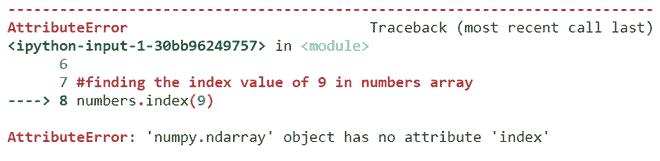

# 如何修复:“numpy.ndarray”对象没有属性“index”

> 原文:[https://www . geesforgeks . org/how-fix-numpy-ndarray-object-has-no-attribute-index/](https://www.geeksforgeeks.org/how-to-fix-numpy-ndarray-object-has-no-attribute-index/)

**“Numpy . ndarray”对象没有属性“index”**是一个**属性错误**，**表示**在 **Numpy 数组**中没有**索引方法**或**属性**可用。

当我们尝试使用 index 方法在 Numpy 数组中查找特定元素的索引时，会出现此错误。下面代码是一个示例，当“numpy.ndarray”对象没有属性时，会引发“index”错误

**例**:

## 蟒蛇 3

```py
# import necessary packages
import numpy as np

# Create a Numpy array
numbers = np.array([0, 1, 2, 9, 8, 0])

# finding the index value of 9 in 
# numbers array
numbers.index(9)
```

**输出**



由于 Numpy 中没有名为 index 的方法，因此会引发属性错误。

## 解决办法

要修复此错误**不要使用索引方法**来查找元素的索引**使用 where 方法**，其中**返回****数组，该数组由指定元素的索引**组成。

**语法**

> numpy . where(Arrayname = = value _ to _ find _ index)

**例 1:**

指定 Numpy 数组中存在的 where 方法中的元素

## 蟒蛇 3

```py
# import necessary packages
import numpy as np

# Create a Numpy array
numbers = np.array([0, 1, 2, 9, 8, 0])

# finding the index value of 9 in 
# numbers array
np.where(numbers == 9)
```

**输出**

```py
(array([3], dtype=int64),)
```

由于数组中的索引从 0 开始，因此在数字数组中 **0 <sup>第</sup>索引**由**值 0** 、 **1 <sup>st</sup> 索引**具有**值 1** 、 **2 <sup>和</sup>索引**具有**值 2** 和 **3 <sup>第</sup>索引**具有值

**例 2:**

在 where 方法中指定一个元素，以便我们指定的元素在数组中出现多次。

## 蟒蛇 3

```py
# import necessary packages
import numpy as np

# Create a Numpy array
numbers = np.array([0, 1, 2, 9, 8, 0])

# finding the index values of 0 in
# numbers array
np.where(numbers == 0)
```

**输出:**

```py
(array([0, 5], dtype=int64),)
```

由于**元素 0 在数字数组**中出现 2 次**在 0 <sup>第</sup>T8】5<sup>第</sup>索引**处，因此它返回一个由元素 0 的 2 个索引值组成的数组。

**例 3:**

将实际上不在数组中的元素传递给 where 方法。

## 蟒蛇 3

```py
# import necessary packages
import numpy as np

# Create a Numpy array
numbers = np.array([0, 1, 2, 9, 8, 0])

# finding the index value of a number 
# which is not in numbers array
np.where(numbers == 7)
```

**输出**

```py
(array([], dtype=int64),)
```

如果我们将一个**元素**传递给不在数组中的 where 方法**，那么它**将返回一个空数组**，因为在数组的任何索引处都没有指定的元素。这里 **7 在数字数组**中不存在，所以它**返回了一个**空数组**。****