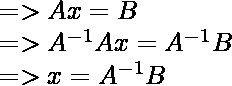

# 如何用 NumPy 求矩阵的逆

> 原文:[https://www . geeksforgeeks . org/如何使用-numpy 对矩阵求逆/](https://www.geeksforgeeks.org/how-to-inverse-a-matrix-using-numpy/)

矩阵的逆只是矩阵的倒数，就像我们在常规算术中对一个数字所做的那样，这个数字被用来解方程以找到未知变量的值。矩阵的逆矩阵是与原矩阵相乘后得到的单位矩阵。矩阵的逆只有在矩阵为**非奇异时才存在，即行列式不应为 0** 。利用行列式和伴随式，我们可以很容易地用下面的公式求出方阵的逆矩阵，

```py
if det(A) != 0
    A-1 = adj(A)/det(A)
else
    "Inverse doesn't exist"  
```

#### 矩阵方程



> **在哪里，**
> 
> **A <sup>-1</sup> :** 矩阵 A 的逆
> 
> **x:**TT3】he 未知变量列 T5】
> 
> ***B:** 解阵*T5】

#### 用 NumPy 求矩阵的逆

Python 提供了一种非常简单的方法来计算矩阵的逆矩阵。python NumPy 模块中的函数**NumPy . linalg . inv()**用于计算矩阵的逆。

> **语法:**
> 
> **numpy . linalg . inv****(***a***)**
> 
> **参数:**
> 
> **a:** 待倒矩阵
> 
> **返回:**
> 
> 逆矩阵 *一* 。

**例 1:**

## 计算机编程语言

```py
# Python program to inverse
# a matrix using numpy

# Import required package
import numpy as np

# Taking a 3 * 3 matrix
A = np.array([[6, 1, 1],
              [4, -2, 5],
              [2, 8, 7]])

# Calculating the inverse of the matrix
print(np.linalg.inv(A))
```

**输出:**

```py
[[ 0.17647059 -0.00326797 -0.02287582]
 [ 0.05882353 -0.13071895  0.08496732]
 [-0.11764706  0.1503268   0.05228758]]
```

**例 2:**

## 计算机编程语言

```py
# Python program to inverse
# a matrix using numpy

# Import required package
import numpy as np

# Taking a 4 * 4 matrix
A = np.array([[6, 1, 1, 3],
              [4, -2, 5, 1],
              [2, 8, 7, 6],
              [3, 1, 9, 7]])

# Calculating the inverse of the matrix
print(np.linalg.inv(A))
```

**输出:**

```py
[[ 0.13368984  0.10695187  0.02139037 -0.09090909]
 [-0.00229183  0.02673797  0.14820474 -0.12987013]
 [-0.12987013  0.18181818  0.06493506 -0.02597403]
 [ 0.11000764 -0.28342246 -0.11382735  0.23376623]]

```

**例 3:**

## 计算机编程语言

```py
# Python program to inverse
# a matrix using numpy

# Import required package
import numpy as np

# Inverses of several matrices can
# be computed at once
A = np.array([[[1., 2.], [3., 4.]],
              [[1, 3], [3, 5]]])

# Calculating the inverse of the matrix
print(np.linalg.inv(A))
```

**输出:**

```py
[[[-2\.    1\.  ]
  [ 1.5  -0.5 ]]

 [[-1.25  0.75]
  [ 0.75 -0.25]]]

```