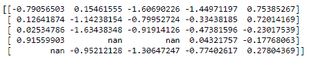
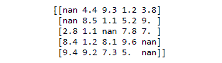
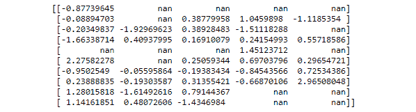
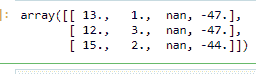

# 如何在 Python 中用 NumPy 在矩阵中随机插入 NaN？

> 原文:[https://www . geesforgeks . org/how-to-random-insert-nan-in-a-matrix-with-numpy-in-python/](https://www.geeksforgeeks.org/how-to-randomly-insert-nan-in-a-matrix-with-numpy-in-python/)

**先决条件:** [Numpy](https://www.geeksforgeeks.org/python-numpy/)

在本文中，让我们看看如何使用 Numpy 生成一个 Python 脚本，将 Nan 随机插入到矩阵中。下面给出了 3 种方法:

### 方法 1:使用 ravel()函数

[ravel](https://www.geeksforgeeks.org/numpy-ravel-python/) ()函数返回连续的扁平数组(包含所有输入数组元素且类型相同的 1D 数组)。只有在需要时才制作副本。
**语法:**

```
numpy.ravel(array, order = 'C')
```

**进场:**

*   导入模块
*   创建数据
*   选择随机指数，以南值为准。
*   将这些索引传递给 ravel()函数
*   打印数据

**例 1:**

## 蟒蛇 3

```
import numpy as np
import pandas as pd

# number of nan we want to add It will insert 3 nan values to the data.....
n = 3

# creating dataset
data = np.random.randn(5, 5)

# choosing random indexes to put NaN
index_nan = np.random.choice(data.size, n, replace=False)

# adding nan to the data.
data.ravel()[index_nan] = np.nan
print(data)
```

**输出:**



**示例 2:** 向添加 nan，但使用 *randint* 函数创建数据。要在 *randint* 函数中使用 *np.nan* ，我们必须首先将数据转换为浮点数，因为 *np.nan* 属于浮点数类型。

## 蟒蛇 3

```
import numpy as np
# number of nan we want to add It will insert 3 nan values to the data.....
n_b = 5

# creating dataset
data_b = np.random.randint(10, 100, size=(5, 5))

# converting the data to float as nan is also of type float
data_b = data_b*0.1

# choosing random indexes to put NaN
index_b = np.random.choice(data_b.size, n_b, replace=False)

# adding nan to the data.
data_b.ravel()[index_b] = np.nan
print(data_b)
```

**输出:**



### **方法 2:创建蒙版**

创建布尔掩码并将该掩码应用于数据集可能是产生所需结果的一种方法。

**进场:**

*   导入模块
*   创建数据
*   创建掩码
*   随机调整遮罩以随机应用 Nan 值
*   将掩码应用于数据
*   打印数据

**示例:**

## 蟒蛇 3

```
import numpy as np

# creating dataset
X = 10
Y = 5
N = 15

data = np.random.randn(X, Y)

# making a array randomly of same size as data of bool type
mask = np.zeros(X*Y, dtype=bool)

# marking first n indexes as true
mask[:N] = True

# shuffling the mask
np.random.shuffle(mask)
mask = mask.reshape(X, Y)

# applying mask to the data
data[mask] = np.nan
print(data)
```

**输出:**



### 方法 3:使用 insert()

使用 [insert()](https://www.geeksforgeeks.org/numpy-insert-python/#:~:text=The%20numpy.,axis%20before%20the%20given%20indices.&text=Return%20%3A,object%20along%20a%20given%20axis.) 函数将整行或整列转换为 NaN。该函数在给定的索引前沿上述轴插入值。
**语法:**

```
numpy.insert(array, object, values, axis = None)
```

**进场:**

*   导入模块
*   创建数据
*   使用插入 Nan 值
*   打印数据

**示例:**

## 蟒蛇 3

```
import numpy as np

a = np.array([(13.0, 1.0, -47.0), (12.0, 3.0, -47.0), (15.0, 2.0, -44.0)])

# adding nan values to the row
np.insert(a, 2, np.nan, axis=0)

# adding nan values to the row
np.insert(a, 2, np.nan, axis=1)
```

**输出:**

