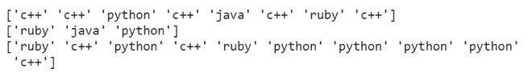
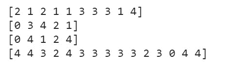
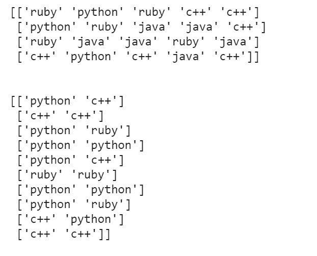
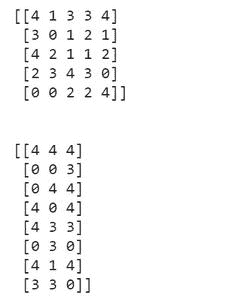

# 如何在 Python 中随机选择 NumPy 数组的元素？

> 原文:[https://www . geesforgeks . org/如何用 python 中的 numpy 随机选择数组元素/](https://www.geeksforgeeks.org/how-to-randomly-select-elements-of-an-array-with-numpy-in-python/)

**先决条件:** [Numpy](https://www.geeksforgeeks.org/numpy-in-python-set-1-introduction/)

随机值在机器学习、统计和概率等数据相关领域非常有用。**[**numpy . choice()**](https://www.geeksforgeeks.org/numpy-random-choice-in-python/)**函数用于从 NumPy 数组中获取随机元素。它是 python 的 NumPy 包中的一个内置函数。****

> ******语法:** numpy.random.choice( a，size = None，replace = True，p = None)****
> 
>  ******参数:**
> 
> *   **a** :一维数组/列表(从其元素生成随机样本)或整数(在该整数范围内生成随机样本)
> *   **大小** : int 或 int 元组(默认为无，返回单个随机值)。如果给定的形状是(m，n)，则绘制 m×n 个随机样本。
> *   **替换**:(可选)；一个布尔值，它指定绘制样本时是否进行替换。当样本大于列表的总体时，替换不能为假。
> *   **p** :(可选)；包含与中每个条目相关的概率的一维数组。如果没有给出，则样本假设在中的所有条目上均匀分布****

### ****方法****

*   ****导入模块****
*   ****创建示例数组****
*   ****从创建的数组中随机选择值****
*   ****打印如此生成的数组。****

****下面给出了 1D 和 2D 阵列的实现。****

******生成一维随机样本列表******

******例 1:******

## ****蟒蛇 3****

```
**import numpy as np

prog_langs = ['python', 'c++', 'java', 'ruby']

# generating random samples
print(np.random.choice(prog_langs, size=8))

# generating random samples without replacement
print(np.random.choice(prog_langs, size=3, replace=False))

# generating random samples with probabilities
print(np.random.choice(prog_langs, size=10,
                       replace=True, p=[0.3, 0.5, 0.0, 0.2]))**
```

******输出:******

********

******例 2:******

## ****蟒蛇 3****

```
**import numpy as np

samples = 5
# generating random samples
print(np.random.choice(samples, size=10))

# generating random samples without replacement
print(np.random.choice(samples, size=5, replace=False))

# generating random samples with probabilities
print(np.random.choice(samples, size=5, replace=True))

# generating with probabilities
print(np.random.choice(samples, size=15,
                       replace=True, p=[0.2, 0.1, 0.1, 0.3, 0.3]))**
```

******输出:******

********

******生成随机样本的二维列表******

******示例:******

## ****蟒蛇 3****

```
**import numpy as np

prog_langs = ['python', 'c++', 'java', 'ruby']

# generating random samples
print(np.random.choice(prog_langs, size=(4, 5)))

# generating random samples with probabilities
print('\n')
print(np.random.choice(prog_langs, size=(10, 2),
                       replace=True, p=[0.3, 0.5, 0.0, 0.2]))**
```

******输出:******

********

******例 2:******

## ****蟒蛇 3****

```
**import numpy as np

samples = 5

# generating random samples
print(np.random.choice(samples, size=(5, 5)))

# generating with probabilities
print('\n')
print(np.random.choice(samples, size=(8, 3),
                       replace=True,
                       p=[0.2, 0.1, 0.1, 0.3, 0.3]))**
```

******输出:******

********