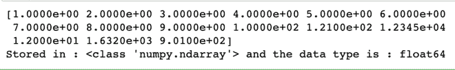

# 如何用 numpy 读取 Python 中的数值数据或文件？

> 原文:[https://www . geesforgeks . org/如何用 numpy 读取 python 中的数字数据或文件/](https://www.geeksforgeeks.org/how-to-read-a-numerical-data-or-file-in-python-with-numpy/)

**先决条件** : [**Numpy**](https://www.geeksforgeeks.org/numpy-in-python-set-1-introduction/)

NumPy 是一个通用的数组处理包。它提供了一个高性能多维数组对象和使用这些数组的工具。本文描述了如何使用 Numpy 从文件中读取数字数据。

数字数据可以以不同的文件格式呈现:

*   数据可以保存在一个 txt 文件中，每行都有一个新的数据点。
*   数据可以存储在 CSV(逗号分隔值)文件中。
*   数据也可以存储在 TSV(制表符分隔值)文件中。

在文件中存储数据有多种方式，以上是一些最常用的数字数据存储格式。为了实现我们所需的功能，将使用 numpy 的 [loadtxt()](https://www.geeksforgeeks.org/numpy-loadtxt-in-python/) 功能。

> ***语法:** numpy.loadtxt(fname，dtype='float '，comments='# '，分隔符=None，转换器=None，skiprows=0，usecols=None，unpack=False，ndmin=0)*
> 
> ***参数:***
> ***fname :** 要读取的文件、文件名或生成器。如果文件扩展名为。gz 或. bz2，文件首先被解压缩。请注意，生成器应该为 Python 3k 返回字节字符串。*
> ***数据类型:**结果数组的数据类型；默认值:float。如果这是一个结构化的数据类型，结果数组将是一维的，并且每一行都将被解释为数组的一个元素。*
> ***分隔符:**用于分隔值的字符串。默认情况下，这是任何空白。*
> ***转换器:**将列号映射到将该列转换为浮点数的函数的字典。例如，如果列 0 是日期字符串:converters = {0: datestr2num}。默认值:无。*
> ***Skip prows:**跳过第一个 Skip prows 的台词；默认值:0。*
> 
> *T1】返回:ndaray*

### 方法

*   导入模块
*   加载文件
*   读取数字数据
*   打印检索到的数据。

下面给出了各种文件格式的一些实现:

**下载所用数据文件的链接:**

*   [**link 1**](https://drive.google.com/file/d/17FHcX2eBUnm_BUjBUYF6MWxHca8hkdcC/view?usp=sharing):gfg _ example 1 . txt
*   [**link 2**](https://drive.google.com/file/d/1mw_zAvSf5g6ShKIN_Wd8ppPHQqHDE3fT/view?usp=sharing):gfg _ example 2 . CSV
*   [**Link 3**](https://drive.google.com/file/d/1HGdfhSfBd4mpcXv5eVeESrQxWhPaAg-Z/view?usp=sharing):gfg _ example 3 . tsv
*   [**Link 4**](https://drive.google.com/file/d/1T5f0I0XUsjd25wLpO8Df_o5zcjifwAF4/view?usp=sharing):gfg _ example 4 . CSV

**例 1:** 从文本文件中读取数值数据

## 蟒蛇 3

```py
# Importing libraries that will be used
import numpy as np

# Setting name of the file that the data is to be extracted from in python
filename = 'gfg_example1.txt'

# Loading file data into numpy array and storing it in variable called data_collected
data_collected = np.loadtxt(filename)

# Printing data stored
print(data_collected)

# Type of data
print(
    f'Stored in : {type(data_collected)} and data type is : {data_collected.dtype}')
```

**输出:**



示例 1 的输出

**例 2:** 从 CSV 文件中读取数值数据。

## 蟒蛇 3

```py
# Importing libraries that will be used
import numpy as np

# Setting name of the file that the data is to be extracted from in python
# This is a comma separated values file
filename = 'gfg_example2.csv'

# Loading file data into numpy array and storing it in variable.
# We use a delimiter that basically tells the code that at every ',' we encounter,
# we need to treat it as a new data point.
# The data type of the variables is set to be int using dtype parameter.
data_collected = np.loadtxt(filename, delimiter=',', dtype=int)

# Printing data stored
print(data_collected)

# Type of data
print(
    f'Stored in : {type(data_collected)} and data type is : {data_collected.dtype}')
```