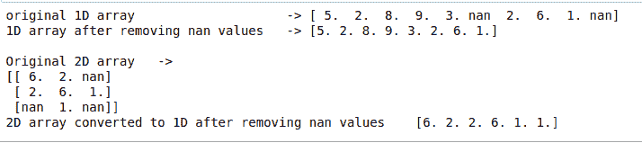

# 如何从给定的 NumPy 数组中移除 NaN 值？

> 原文:[https://www . geeksforgeeks . org/如何从给定的 numpy 数组中移除 nan 值/](https://www.geeksforgeeks.org/how-to-remove-nan-values-from-a-given-numpy-array/)

在本文中，我们将学习如何从给定的数组中移除 Nan 值。man 值是那些没有与之关联的特定值的值，或者它们不同于要在声明的数组中使用的值的类型。

基本上有两种方法以相同的方式工作，只是语法略有不同。要么我们可以使用 NumPy 中指定的函数，要么我们可以使用运算符，基本工作将是相同的。

**方法#1 :** 使用[numpy . logic _ not()](https://www.geeksforgeeks.org/numpy-logical_not-python/)和 numpy.nan()函数

[numpy.isnan()](https://www.geeksforgeeks.org/numpy-isnan-python/) 将给出值为 nan 的所有索引的真实索引，当与 numpy.logical _ not()函数组合时，布尔值将反转。所以，最后，我们得到了所有非 nan 元素的索引。从索引中，我们可以过滤掉不是 nan 的值，并将其保存在另一个数组中。

## 蟒蛇 3

```
import numpy

# create a 1D array
a = numpy.array([5, 2, 8, 9, 3, numpy.nan,
                 2, 6, 1, numpy.nan])

# remove nan values using numpy.isnan()
# and numpy.logical_not
b = a[numpy.logical_not(numpy.isnan(a))]

# print the results
print("original 1D array                    ->", a)
print("1D array after removing nan values   ->", b)
print()

# create a 2D array
c = numpy.array([[6, 2, numpy.nan], [2, 6, 1],
                 [numpy.nan, 1, numpy.nan]])

# remove nan values using numpy.isnan()
# and numpy.logical_not
d = c[numpy.logical_not(numpy.isnan(c))]

# print the results
print("Original 2D array   ->")
print(c)
print("2D array converted to 1D after removing nan values   ", d)
```

**输出:**



**注:**无论数组是什么维度，都会被展平成 1D 数组

**方法 2 :** 将~运算符代替 numpy.logical _ not()与 numpy.isnan()函数相结合。这将与上面的工作方式相同，它将把任意维数组转换成 1D 数组。

例如，在下面的代码中，只显示了 2D 数组。

## 蟒蛇 3

```
import numpy

# create a 2D array
c = numpy.array([[12, 5, numpy.nan, 7], 
                 [2, 61, 1, numpy.nan],
                 [numpy.nan, 1,
                  numpy.nan, 5]])

# remove nan values using numpy.isnan() 
# and numpy.logical_not
d = c[~(numpy.isnan(c))]

# print the results
print("Original 2D array   ")
print(c)
print()

print("2D array converted to 1D after removing nan values   ")
print(d)
```

**输出:**

