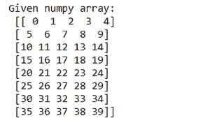
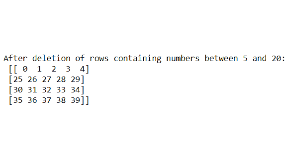
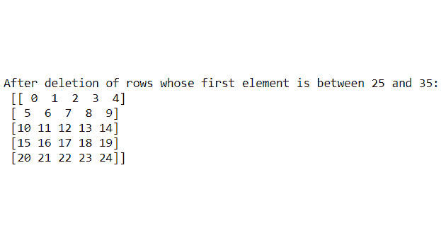
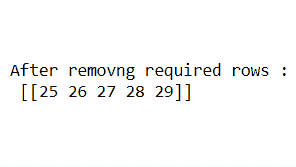

# 如何基于多个条件从 Numpy 数组中移除行？

> 原文:[https://www . geeksforgeeks . org/如何基于多条件从 numpy 数组中移除行/](https://www.geeksforgeeks.org/how-to-remove-rows-from-a-numpy-array-based-on-multiple-conditions/)

在本文中，我们将学习如何基于多个条件从 NumPy 数组中移除行。为了完成我们的任务，我们需要 NumPy 模块提供的一些内置方法，如下所示:

*   [**np.delete(ndarray、**](https://www.geeksforgeeks.org/numpy-delete-python/) [**index、**](https://www.geeksforgeeks.org/numpy-delete-python/)[**axis):**](https://www.geeksforgeeks.org/numpy-delete-python/)**基于给定的索引条件和指定的轴从 NumPy 数组中删除行或列的项目，参数 ndarray 是将发生操作的数组，索引是基于要删除的条件的特定行，在我们的情况下，axis=0 用于删除行。**
*   **[**np.where(条件):**](https://www.geeksforgeeks.org/numpy-where-in-python/) 根据给定轴上的行或列的条件对数组项目进行操作。**

****注意:**对于 2 维 NumPy 数组，如果 axis=0 则删除行，如果 axis=1 则删除列。但是这里我们打算删除行，所以我们将保持 axis=0。**

**让我们以 NumPy 数组为例。这里，我们采用了一个包含 0 到 40 个元素的 NumPy 数组，并将该数组重新整形为 8 行 5 列。**

## **蟒蛇 3**

```
import numpy as np

nparray = np.arange(40).reshape((8, 5))
print("Given numpy array:\n", nparray)
```

****输出:****

****

****示例 1:** 从 NumPy 数组中删除元素在 5 到 20 之间的行**

**这里 NP . where((NP array > = 5)&(NP array < = 20))[0]，axis=0)表示它将删除至少有一个或多个元素大于或等于 5 且小于或等于 20 的行。因此，根据给定的条件，第 2、第 3、第 4 和第 5 行都有元素，因此会被删除或移除。**

## **蟒蛇 3**

```
nparray = np.delete(nparray, np.where(
    (nparray >= 5) & (nparray <= 20))[0], axis=0)

print("After deletion of rows containing
      numbers between 5 and 20: \n", nparray)
```

****输出:****

****

****示例 2:** 从 NumPy 数组中删除第一个元素大于 25 且小于 35 的行**

**这里(np.where(nparray[:，0] >= 25) & (nparray[:，0] <= 35))[0]，axis=0)表示它将删除其中至少有一个或多个元素的第一个元素大于或等于 25 且小于或等于 35 的行。指向每行第一个元素的 nparray[:，0]。所以，根据给定的条件，第 6、7、8 行有元素，所以它被删除或移除。**

## **蟒蛇 3**

```
nparray = np.delete(nparray, np.where(
    (nparray[:, 0] >= 25) & (nparray[:, 0] <= 35))[0], axis=0)

print("After deletion of rows whose first element \
is between 25 and 35:\n", nparray)
```

****输出:****

****

****示例 3:** 删除第三项可被 2 整除、第五项和第四项可被 3 整除的行**

**这里 np.where((nparray[:，2] % 2 == 0) | (nparray[:，4] % 3 == 0)| (nparray[:，3] % 3 == 0))[0]，axis=0)表示它将删除至少有一个或多个元素的第三列项可被 3 整除的行，或者删除至少有一个或多个元素的第五列项和第四列项可被 3 axis=0 整除的行，以删除这些行。nparray[:，2]，nparray[:，4]，nparray[:，3]分别指向每行的第三、第五和第四项。所以，根据给定的条件，第 6、第 7、第 8 行有元素，所以它被删除或移除。**

## **蟒蛇 3**

```
nparray = np.delete(nparray, np.where((nparray[:, 2] % 2 == 0) | (
    nparray[:, 4] % 3 == 0) | (nparray[:, 3] % 3 == 0))[0], axis=0)

print("After removing required rows :\n", nparray)
```

****输出:****

****