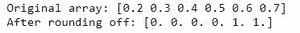
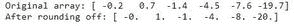

# 如何将 NumPy 数组的元素舍入到最近的整数？

> 原文:[https://www . geeksforgeeks . org/如何将 numpy 数组的元素舍入到最接近的整数/](https://www.geeksforgeeks.org/how-to-round-elements-of-the-numpy-array-to-the-nearest-integer/)

**先决条件:** [蟒怒](https://www.geeksforgeeks.org/python-numpy/)

在本文中，让我们讨论如何将 NumPy 数组的元素舍入到最近的整数。[Python 的 numpy.rint()](https://www.geeksforgeeks.org/numpy-rint-python/) 函数，可以将数组的元素转换为最近的整数。

> **语法:** numpy.rint(x，/，out=None，*，其中=True，casting='same_kind '，order='K '，dtype=None，subok=True[，signature，extobj]) = < ufunc 'rint' >

**例 1:**

## 蟒蛇 3

```py
import numpy as n

# create array
y = n.array([0.2, 0.3, 0.4, 0.5, 0.6, 0.7])
print("Original array:", end=" ")
print(y)

# rount to nearest integer
y = n.rint(y)
print("After rounding off:", end=" ")
print(y)
```

**输出:**



**例 2:**

## 蟒蛇 3

```py
import numpy as n

# create array
y = n.array([-0.2, 0.7, -1.4, -4.5, -7.6, -19.7])
print("Original array:", end=" ")
print(y)

# rount to nearest integer
y = n.rint(y)
print("After rounding off:", end=" ")
print(y)
```

**输出:**

