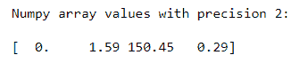

# 如何用 NumPy 抑制科学符号对小数字的使用？

> 原文:[https://www . geeksforgeeks . org/如何使用-numpy/](https://www.geeksforgeeks.org/how-to-suppress-the-use-of-scientific-notations-for-small-numbers-using-numpy/) 抑制对小数字使用科学符号

有时我们有科学符号中的元素，为了简单起见，我们不得不抑制科学符号。为此，我们调用一个名为 **numpy.set_printoptions()的函数。**该功能有助于将科学记数和显示数字压制到一定精度。

> **语法:**numpy . set _ print options**(***精度=无* **、** *阈值=无* **、** *边缘项目=无* **、** *线宽=无* **、** *抑制 *float mode = None***、** *** **、***legacy = None***)***
> 
> **参数:**
> 
> *   **精度:**浮点输出的精度位数(默认为 8)
> *   **抑制:**如果为真，始终使用定点记数法打印浮点数，如果为假，则当最小数的绝对值为< 1e-4 时使用科学记数法
> 
> 其余参数是可选的。

**例 1:**

## 蟒蛇 3

```py
# Importing Numpy library 
import numpy as np

# Creating a 1-D Numpy array
num = np.array([1.8e-10, 1.586, 150.45, 0.2855]) 

# Suppressing 1-D numpy array with precision 2 
# using numpy.set_printoptions()
print("Numpy array values with precision 2:\n")
np.set_printoptions(precision = 2, suppress = True)
print(num)
```

**输出:**



在上面的例子中，我们用**精度 2 来抑制 **1-D** NumPy 数组元素的科学符号。**

**例 2:**

## 蟒蛇 3

```py
# Importing Numpy library 
import numpy as np

# Creating a 2-D Numpy array
num = np.array([[3.1415, 2.7182],
                 [6.6260e-34, 6.6743e-11]]) 

# Suppressing 2-D numpy array with precision 3 
# using numpy.set_printoptions()
print("Numpy array values with precision 3:\n")
np.set_printoptions(precision = 3, suppress = True)
print(num)
```