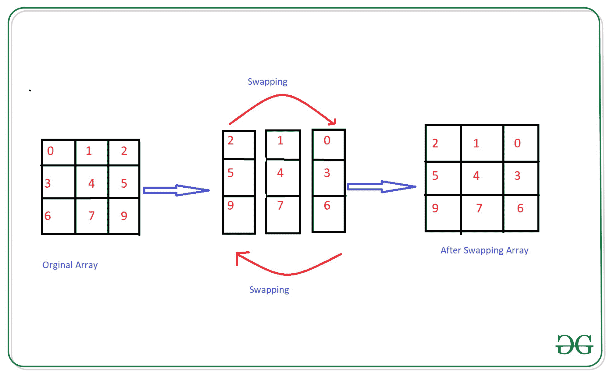

# 如何交换给定 NumPy 数组的列？

> 原文:[https://www . geeksforgeeks . org/如何交换给定 numpy 数组的列/](https://www.geeksforgeeks.org/how-to-swap-columns-of-a-given-numpy-array/)

在本文中，让我们讨论如何交换给定 NumPy 数组的列。



**进场:**

*   导入 NumPy 模块
*   创建一个 NumPy 数组
*   用索引交换列
*   打印最终阵列

**示例 1:** 交换数组的列。

## 蟒蛇 3

```
# importing Module
import numpy as np

# creating array with shape(4,3)
my_array = np.arange(12).reshape(4, 3)
print("Original array:")
print(my_array)

# swapping the column with index of
# original array
my_array[:, [2, 0]] = my_array[:, [0, 2]]
print("After swapping arrays the last column and first column:")
print(my_array)
```

**输出:**

```
Original array:
[[ 0  1  2]
 [ 3  4  5]
 [ 6  7  8]
 [ 9 10 11]]
After swapping arrays the last column and first column:
[[ 2  1  0]
 [ 5  4  3]
 [ 8  7  6]
 [11 10  9]]
```

**示例 2:** 用用户选择的值交换数组的列。

## 蟒蛇 3

```
# Importing Module
import numpy as np

# Creating array
my_array = np.arange(12).reshape(4, 3)
print("Original Array : ")
print(my_array)
# creating function for swap

def Swap(arr, start_index, last_index):
    arr[:, [start_index, last_index]] = arr[:, [last_index, start_index]]

# passing parameter into the function
Swap(my_array, 0, 1)
print(" After Swapping :")
print(my_array)
```

**输出:**

```
Original Array : 
[[ 0  1  2]
 [ 3  4  5]
 [ 6  7  8]
 [ 9 10 11]]
 After Swapping :
[[ 1  0  2]
 [ 4  3  5]
 [ 7  6  8]
 [10  9 11]]
```